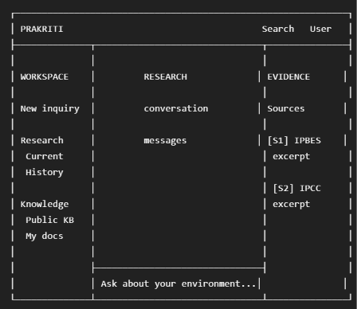
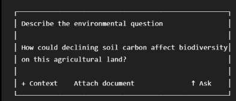

### **PRAKRITI-AI — FRONTEND ART DIRECTION + PRODUCT UI OVERHAUL**

You are redesigning the existing Prakriti-AI frontend.

**Repository:**
https://github.com/RatishPatil37/Prakriti-AI

**LIVE PRODUCT:**
https://prakriti-ai-eta.vercel.app/

This is NOT a generic AI chatbot.

**Prakriti-AI is an AI Environmental Scientist:**
a scientific, evidence-grounded environmental intelligence workspace.

The goal is to make the frontend feel like a serious $1M+ professional research product.

**CRITICAL:**
DO NOT make it look like an AI-generated website.

Do NOT use the visual language currently overused by AI-generated websites:

- purple/blue gradient backgrounds
- glowing blobs
- excessive glassmorphism
- neon green borders
- floating gradient spheres
- giant "AI" headings
- excessive rounded cards
- random decorative particles
- generic robot illustrations
- fake dashboard metrics
- excessive shadows
- generic "Unlock the power of AI" copy
- excessive animations
- generic SaaS landing-page sections

The product should feel designed by a senior product designer for scientists,
researchers, environmental consultants and technically sophisticated users.

==================================================
DESIGN REFERENCES
=================

Study the interaction patterns of:

assistant-ui:
https://github.com/assistant-ui/assistant-ui

LobeChat:
https://github.com/lobehub/lobe-chat

Chatbot UI:
https://github.com/mckaywrigley/chatbot-ui

LibreChat:
https://github.com/danny-avila/LibreChat

Vercel AI SDK:
https://github.com/vercel/ai

Use these repositories as UX/interaction references.

DO NOT copy their branding or visual identity.

Absorb:

- mature chat composition
- streaming behavior
- conversation organization
- source/evidence surfaces
- message actions
- responsive behavior
- keyboard interactions
- information density
- professional application layout

Then create a DISTINCT visual identity for Prakriti-AI.

==================================================
CORE VISUAL CONCEPT
===================

Prakriti-AI should feel like:

scientific research workstation
+
environmental field notebook
+
modern editorial software
+
high-end professional data product

NOT:

ChatGPT clone
AI landing page
generic SaaS dashboard

Visual qualities:

quiet
precise
editorial
scientific
human
trustworthy
information-dense
premium
restrained

==================================================
COLOR SYSTEM
============

Use a restrained natural palette.

Base:
warm off-white / paper background

Primary:
deep forest green

Text:
near-black charcoal

Secondary:
muted stone / warm gray

Borders:
very subtle neutral gray

Success:
natural muted green

Warning:
earthy amber

Error:
muted red

Do NOT use multiple accent colors just for visual excitement.

Do NOT use gradients as the primary visual identity.

Do NOT use neon colors.

==================================================
TYPOGRAPHY
==========

Typography should create hierarchy.

Prefer:
Inter / Geist / IBM Plex Sans

Use strong typographic hierarchy instead of oversized cards.

Potentially use a restrained serif font for:

- editorial section labels
- scientific source titles
- occasional hero statement

Do not mix many fonts.

==================================================
OVERALL APPLICATION LAYOUT
==========================

Transform the application into a professional research workspace.

Desktop:

The exact dimensions can differ.

The principle is:
LEFT = workspace/navigation
CENTER = scientific conversation
RIGHT = evidence/context

On smaller screens:
collapse these intelligently rather than simply shrinking everything.

==================================================
LEFT SIDEBAR
============

Keep it extremely clean.

Sections:

WORKSPACE

New inquiry

RESEARCH
Current
History

KNOWLEDGE
Public knowledge
My documents

Do not fill the sidebar with decorative icons.

Use icons sparingly.

Sidebar should feel closer to Linear / Arc / professional research software
than a gaming dashboard.

==================================================
TOP BAR
=======

Minimal.

Left:
Prakriti wordmark

Center/right:
search or command palette trigger

Right:
profile / account

Avoid huge header branding.

==================================================
EMPTY STATE
===========

Create a distinctive scientific empty state.

Do NOT use:

"How can I help you today?"

Instead communicate the actual product.

Example direction:

PRAKRITI

Environmental intelligence,
grounded in evidence.

Ask about a landscape, ecosystem,
soil condition, biodiversity change,
or restoration decision.

Then show 3–4 realistic investigation prompts.

Examples:

"Soil carbon and biodiversity"

"Water availability and vegetation"

"Land degradation and restoration"

"Habitat fragmentation"

These should look like research starting points,
not AI prompt cards.

==================================================
CHAT AREA
=========

Messages should NOT look like standard ChatGPT bubbles.

Use an editorial document-like layout.

User messages:
subtle background / alignment

Scientist responses:
clean typography with sections.

Example:

RECOMMENDATION

Reduce intensive soil disturbance and increase
continuous ground cover.

WHY THIS MATTERS

...

IMPACTED METRICS

Soil carbon     ↑
Moisture        ↑
Habitat         ↗

TIME HORIZON

Medium term

EVIDENCE

[S1] IPBES 2018
[S2] IPCC 2019

Make the answer highly readable.

==================================================
EVIDENCE RAIL
=============

This should be a signature Prakriti-AI feature.

Do not make it look like a generic "Sources" accordion.

Design a professional evidence rail.

Example:

EVIDENCE
────────────────────

01  IPBES · 2018
    Land Degradation
    & Restoration

    relevant excerpt...

    p. 18                       →

02  IPCC · 2019
    Climate Change
    & Land

    relevant excerpt...

    p. 42                       →

Clicking should reveal a source drawer/detail view.

Include when available:

- organization
- title
- year
- page
- section
- DOI
- source URL
- excerpt

Make evidence feel first-class.

==================================================
RESEARCH CONTEXT
================

Create a compact expandable context panel.

Example:

RESEARCH CONTEXT

Location
Mumbai, Maharashtra

Climate
Tropical / humid

SOIL
SOC       0.8%
pH        6.4

LAND
Mixed agriculture

WATER
Seasonal availability

Keep this hidden/collapsed by default if appropriate.

Do NOT make the main UI look like a giant form.

==================================================
COMPOSER
========

Make the composer one of the strongest components.

Example:

Requirements:

- autosizing textarea
- excellent focus state
- keyboard submit
- subtle border
- no glowing input
- no oversized pill shape
- attachment affordance
- context affordance
- clear submit action

==================================================
STREAMING STATE
===============

Streaming must feel intentional.

Show:

- subtle progress state
- evidence retrieval state if already available
- response appearing naturally
- no fake "AI thinking..." theater
- no fake chain-of-thought exposure

Never expose private internal reasoning.

==================================================
LOADING STATES
==============

Avoid generic spinning loaders everywhere.

Use contextual skeletons / subtle status text.

Examples:

Retrieving evidence…

Reviewing environmental context…

Preparing response…

These are interface states only.
Do not claim internal model reasoning that isn't actually happening.

==================================================
SOURCE DRAWER
=============

When a source is opened:

show:

Source
IPBES

Title
Land Degradation and Restoration

Year
2018

Page
18

Section
...

Excerpt

...

Metadata

DOI / official URL if available

Keep it extremely readable.

==================================================
DOCUMENTS
=========

My Documents should feel like a research library.

Show:

document title
type
date
status

Use table/list layout rather than giant cards.

Example:

DOCUMENTS

Name                         Status
────────────────────────────────────────
Field survey notes.pdf       Ready
Soil analysis.pdf            Ready
Restoration report.pdf       Ready

==================================================
ANIMATIONS
==========

Use motion only when it communicates state.

Good:

- sidebar transition
- drawer transition
- message appearance
- source highlight
- composer focus
- hover feedback

Bad:

- floating blobs
- infinite background animation
- parallax everywhere
- spinning decorative objects
- excessive spring animations

Keep motion fast and subtle.

==================================================
RESPONSIVE DESIGN
=================

Desktop:
three-zone workspace

Tablet:
two-zone layout

Mobile:
single-column

On mobile:

- evidence becomes a bottom drawer
- sidebar becomes a sheet
- context becomes a modal/drawer

Do not simply shrink desktop.

==================================================
ACCESSIBILITY
=============

Maintain:

- keyboard navigation
- visible focus states
- semantic buttons
- aria labels
- adequate contrast
- reduced-motion support
- readable font sizes

Do not sacrifice accessibility for aesthetics.

==================================================
ICONOGRAPHY
===========

Use one icon family consistently.

Lucide is acceptable if already installed.

Do not mix:
Font Awesome + random SVG + emoji + custom icons.

Avoid decorative icons that don't communicate anything.

==================================================
COPY
====

Rewrite generic UI copy to sound like a scientific product.

Avoid:
"AI powered"
"Unlock insights"
"Supercharge"
"Ask anything"
"Your intelligent assistant"
"Magic"

Prefer:
"Research"
"Evidence"
"Environmental context"
"Scientific sources"
"Investigation"
"Field notes"
"Knowledge base"

==================================================
IMPORTANT — PRESERVE FUNCTIONALITY
===================================

Do NOT break:

- Supabase auth
- JWT handling
- Qdrant retrieval
- SSE streaming
- evidence retrieval
- private/public document isolation
- uploads
- document deletion
- existing API contracts
- existing environment variables

Do not migrate the backend.

Do not migrate from Vite to Next.js.

Do not replace FastAPI.

Do not introduce another database.

Do not replace Qdrant.

Do not replace Supabase.

Do not replace Gemini.

This task is primarily FRONTEND DESIGN + UX.

==================================================
ANTI-SLOP REQUIREMENT
=====================

Before considering the redesign finished, inspect every screen and ask:

"Could this screenshot be mistaken for a generic AI-generated SaaS template?"

If yes:
remove the generic elements.

The interface should have a recognizable Prakriti identity.

Avoid:

- excessive rounded rectangles
- excessive gradients
- huge typography
- generic AI illustrations
- glowing buttons
- generic dashboard cards
- fake statistics
- decorative "AI" motifs

The design should look intentionally art-directed.

==================================================
IMPLEMENTATION
==============

First inspect the current frontend architecture.

Identify:

- current routes
- components
- styles
- design tokens
- chat implementation
- evidence components
- context components
- document components

Then create a design system layer where appropriate:

colors
typography
spacing
radius
borders
shadows
motion

Do not duplicate styling throughout components.

Reuse existing components where possible.

Refactor only where necessary.

==================================================
VISUAL QA
=========

After implementation:

1. Run the frontend.
2. Inspect every major screen.
3. Test desktop.
4. Test tablet.
5. Test mobile.
6. Test empty state.
7. Test active conversation.
8. Test streaming.
9. Test evidence rail.
10. Test source drawer.
11. Test document library.
12. Test authentication state.
13. Test error state.
14. Test loading state.

Then run:

npm run build

Fix all TypeScript/build errors.

Do not stop at "the code compiles."

Perform a visual review.

==================================================
FINAL QUALITY BAR
=================

The final product should feel like:

"Someone spent months designing this scientific software."

NOT:

"An AI agent generated a Tailwind dashboard."

The UI should be memorable because of:

- typography
- information architecture
- evidence presentation
- restrained visual language
- interaction quality
- scientific identity

not because of visual effects.

DO NOT modify backend functionality unless absolutely necessary for frontend integration.

Before making major changes, inspect the existing code and reuse it.

Start with the current frontend.
