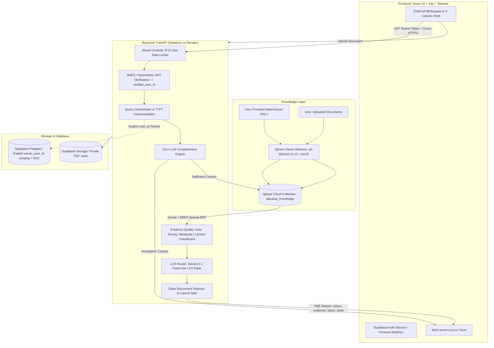

# 🌿 Darukaa.Earth — AI Biodiversity & Environmental Scientist

[](backend/tests/)
[](frontend/)
[](backend/src/retriever/)
[](backend/src/api/auth.py)

A production-grade, evidence-grounded AI conversational intelligence platform built for the **Darukaa.Earth Hackathon Challenge**. Unlike generic LLM wrappers, this system operates as an **AI Environmental Scientist**: it couples an authoritative scientific knowledge layer in **Qdrant Cloud** with server-side hybrid retrieval (dense + BM25 sparse vectors via RRF), JWKS-verified Supabase JWT multi-tenant isolation for private documents, a deterministic multi-metric reasoning scaffold, an Evidence Quality assessment gate, and sub-second warm-target TTFT streaming over Server-Sent Events (SSE).

---

## 🏛️ System Architecture



---

## 🔬 Core Differentiators & Compliance

### 1. Hybrid Retrieval (Qdrant Server-Side RRF)
- Single collection (`darukaa_knowledge`) using named vectors:
  - `dense`: 384-dimensional dense semantic vectors (Cosine distance).
  - `bm25`: Qdrant-native sparse BM25 vectors with IDF modifiers.
- Fuses top dense (20) and sparse (20) prefetches server-side with Reciprocal Rank Fusion (`Fusion.RRF`).
- Never runs process-local `rank-bm25` or local in-memory indices.

### 2. Multi-Tenant Security & Zero Tenant Leakage
- **Identity Enforcement**: Identity is strictly derived server-side from verified Supabase JWTs (`sub` claim). Client-supplied `user_id` is never accepted or trusted.
- **Immutable Tenant Filter**: Every query applies:
  ```python
  (scope == "public") OR (scope == "private" AND owner_user_id == verified_user_id)
  ```
- **Fallback Invariant**: If optional topical filters return 0 results, the system relaxes topical tags but **never** relaxes the tenant visibility boundary.
- **Synchronous Deletion**: Document deletion executes `qdrant.delete(..., wait=True)` ensuring immediate purge from vector space before database status updates.
- **IDOR Guard**: Source lookups (`GET /api/v1/sources/{id}`) enforce identical tenant checks to prevent unauthorized private document access.

### 3. Conversational Intelligence & Reasoning
- **Zero-LLM Fast Clarification**: Incomplete intervention requests (e.g. missing SOC %, rainfall, land use) trigger an immediate SSE clarification event with 2–3 targeted questions without consuming LLM tokens.
- **Conditional Multi-Metric Scaffold**:
  - Intervention / Restoration queries explicitly connect $\ge 3$ environmental dimensions (e.g., Cover crops/Tillage → SOC & Moisture → Microbial & Pollinators).
  - Conceptual queries (e.g., "What is soil organic carbon?") provide direct, unforced scientific definitions.
- **Evidence Quality Gate**: Evaluates Evidence Quality qualitatively (`Strong`, `Moderate`, `Limited`, `Insufficient`) grounded in source corroboration and provenance.
- **Streaming Citation Integrity**: Pre-generation manifest `[S1]`, `[S2]`, ... emitted in real-time. Post-stream verification records citation audit status before database persistence.

### 4. API Abuse Controls & Defense-in-Depth
- **Sliding-Window Rate Limiting**:
  - Unauthenticated anonymous requests: 5 requests/minute per client IP.
  - Authenticated requests: 20 requests/minute per verified `user_id`.
- **Quotas**: Maximum 1,000 characters for queries; maximum 25MB, 100 pages, and 10 documents per user.
- **Client Disconnect Cancellation**: In the SSE generator loop, `await request.is_disconnected()` terminates upstream Gemini token streaming immediately if the user leaves or cancels.

---

## 🗄️ Database Schema & RLS

Postgres tables managed via Supabase with defense-in-depth: all server-side queries explicitly scope to `owner_user_id`:

```sql
create table public.documents (
    id uuid primary key default gen_random_uuid(),
    owner_user_id uuid not null references auth.users(id) on delete cascade,
    title text not null,
    storage_path text,
    scope text not null default 'private' check (scope in ('private', 'workspace')),
    status text not null default 'ready' check (status in ('pending','processing','indexing','ready','failed','deleting','deleted')),
    content_hash text,
    page_count integer,
    chunk_count integer,
    created_at timestamptz not null default now()
);

create table public.conversations (
    id uuid primary key default gen_random_uuid(),
    owner_user_id uuid not null references auth.users(id) on delete cascade,
    title text,
    created_at timestamptz not null default now()
);

create table public.messages (
    id uuid primary key default gen_random_uuid(),
    conversation_id uuid not null references public.conversations(id) on delete cascade,
    owner_user_id uuid not null references auth.users(id) on delete cascade,
    role text not null check (role in ('user','assistant','system')),
    content text not null,
    citations jsonb not null default '[]'::jsonb,
    request_id uuid,
    created_at timestamptz not null default now()
);

-- Enable RLS
alter table public.documents enable row level security;
alter table public.conversations enable row level security;
alter table public.messages enable row level security;
```

---

## 🚀 Quickstart & Local Setup

### Prerequisites
- Python 3.11+
- Node.js 18+

### 1. Backend Setup

```bash
# Install Python dependencies
pip install -r backend/requirements.txt

# Copy configuration
cp .env.example .env

# Run automated test suite (Tests A-F, citations, streaming, rate limits)
python -m pytest backend/tests/ -v

# Start the FastAPI backend
uvicorn backend.src.api.main:app --reload --port 8000
```

The API docs are available at `http://localhost:8000/docs`.

### 2. Frontend Setup

```bash
cd frontend

# Install Node dependencies
npm install

# Run Vite development server
npm run dev

# Or build for production
npm run build
```

The application runs at `http://localhost:5173`.

---

## 🧪 Test Matrix & Validation Results

The test suite in `backend/tests/` verifies the complete security and reasoning matrix:

| Test Name | File | Description | Result |
|---|---|---|:---:|
| **Test A: Private Visibility** | `test_security_isolation.py` | User B queries for User A's private document title → receives 0 chunks | **PASSED** |
| **Test B: Secret Phrase Leak** | `test_security_isolation.py` | User B queries unique private phrase → 0 leaks | **PASSED** |
| **Test C: Synchronous Deletion** | `test_security_isolation.py` | Document deleted with `wait=True` is synchronously expunged from Qdrant | **PASSED** |
| **Test D: Tenant Query Isolation** | `test_security_isolation.py` | User A retrieves own document; User B isolated | **PASSED** |
| **Test E: Filter Relaxation** | `test_security_isolation.py` | Relaxing region filters preserves strict tenant boundary | **PASSED** |
| **Test F: IDOR Protection** | `test_security_isolation.py` | User B directly accessing User A source ID receives 404/blocked | **PASSED** |
| **Citation Integrity** | `test_citations.py` | Validates `[S#]` tags against pre-generation manifest; flags fake citations | **PASSED** |
| **Zero-LLM Clarification** | `test_completeness.py` | Incomplete intervention queries trigger clarification; definitions pass | **PASSED** |
| **Abuse Rate Limiting** | `test_rate_limit.py` | Anonymous IP (5/min) and authenticated user (20/min) limits enforced | **PASSED** |
| **Streaming & Disconnect** | `test_streaming.py` | SSE stream protocol verified; client disconnect terminates generation | **PASSED** |

---

## 🚢 Deployment (Free Tier Topology)

- **Frontend**: Deployed on **Vercel Hobby** (`https://darukaa-earth-ai.vercel.app`).
- **Backend**: Deployed on **Render Free** (`https://darukaa-earth-ai-api.onrender.com`).
- **Vector Database**: **Qdrant Cloud Free** (Single-node 0.5 vCPU, 1GB RAM, 4GB disk).
- **Auth & Database**: **Supabase Free** (500MB DB, 1GB Storage).
- **LLM**: **Google AI Studio Gemini API** (`gemini-3.1-flash-lite`, `gemini-3.5-flash`).

*Note on Latency Telemetry*: On Render Free tier, cold-start latency after 15 minutes of inactivity is approximately 45–60 seconds. Warm-request TTFT is instrumented and targeted at sub-second arrival (<800ms).

---

## 👥 Hackathon Reviewer Access

For private repository access, collaborators have been invited:
- `ankita.dasgupta@darukaa.com`
- `harsh.kumar@darukaa.com`
- `utkarsh.gauniyal@darukaa.com`
- `guneet.mutreja@darukaa.com`

Submission document compiled in `submission/SUBMISSION_OVERVIEW.md`.
