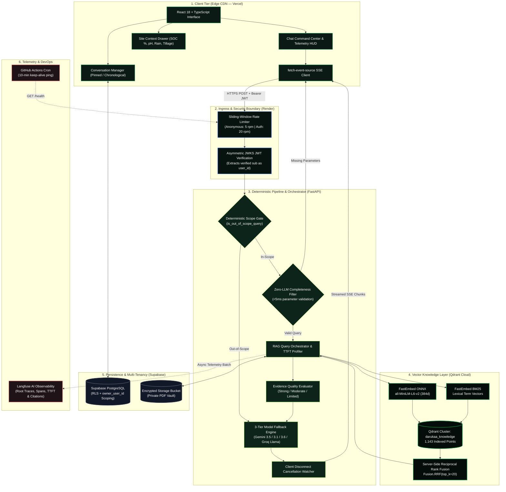
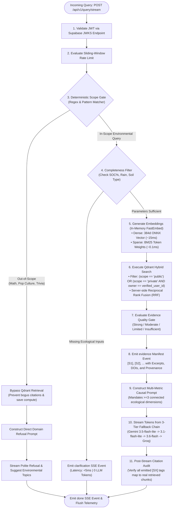
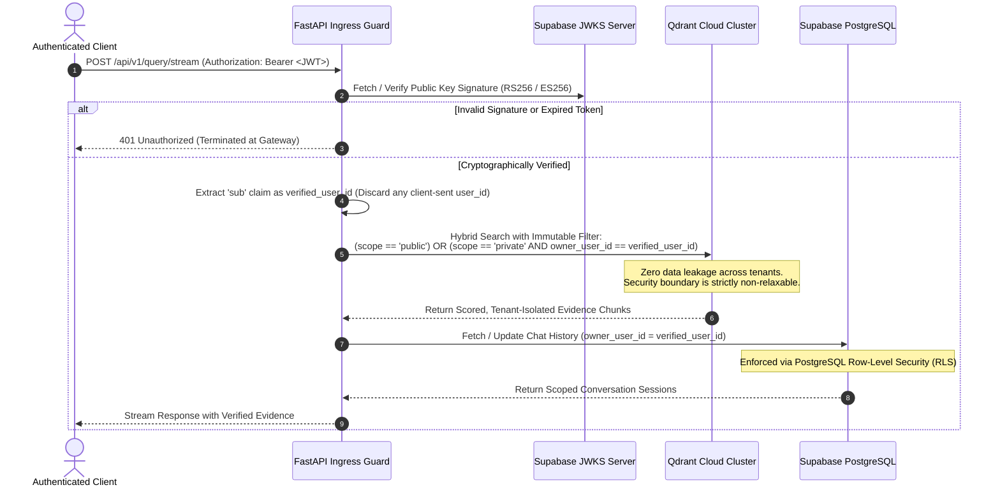
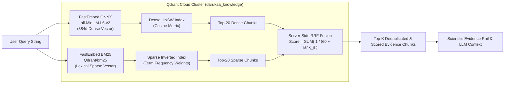

# 🌿 Prakriti AI — AI Biodiversity & Environmental Science Intelligence Platform

<p align="center">
  
  
  
  
  
  
</p>

---

## 📑 Table of Contents
- [1. Overview & Core Specifications](#1-overview--core-specifications)
- [2. Live Deployments & Health Endpoints](#2-live-deployments--health-endpoints)
- [3. System Architecture](#3-system-architecture)
  - [3.1 High-Level Component Topology](#31-high-level-component-topology)
  - [3.2 End-to-End Query Execution Pipeline](#32-end-to-end-query-execution-pipeline)
  - [3.3 Zero-Trust Multi-Tenant Isolation Flow](#33-zero-trust-multi-tenant-isolation-flow)
  - [3.4 Hybrid Vector Retrieval & Server-Side RRF Fusion](#34-hybrid-vector-retrieval--server-side-rrf-fusion)
- [4. Technical Core & Invariants](#4-technical-core--invariants)
  - [4.1 Hybrid Retrieval Engine (Qdrant RRF)](#41-hybrid-retrieval-engine-qdrant-rrf)
  - [4.2 Deterministic Guardrails & Zero-LLM Pre-Filters](#42-deterministic-guardrails--zero-llm-pre-filters)
  - [4.3 3-Tier LLM Resiliency Chain](#43-3-tier-llm-resiliency-chain)
  - [4.4 Full-Lifecycle Observability (Langfuse)](#44-full-lifecycle-observability-langfuse)
  - [4.5 Sub-Second Latency & TTFT Optimizations](#45-sub-second-latency--ttft-optimizations)
- [5. Repository File Structure](#5-repository-file-structure)
- [6. Local Development & Deployment](#6-local-development--deployment)
- [7. Automated Test Suite](#7-automated-test-suite)
- [8. Security & Compliance Invariants](#8-security--compliance-invariants)

---

## 1. Overview & Core Specifications

**Prakriti AI** is an enterprise-grade AI conversational intelligence system engineered for **Darukaa.Earth**. It functions as an authoritative **AI Environmental Scientist**, processing complex ecological dynamics (soil organic carbon, rainfall gradients, agroforestry interventions, microbial biodiversity) into audit-ready scientific decisions grounded in peer-reviewed literature.

### Technical Baseline
* **Runtime Backend**: FastAPI (Python 3.11) on Render Linux Container.
* **Frontend Client**: React 18, TypeScript, Vite, Tailwind CSS on Vercel Edge.
* **Vector Knowledge Layer**: Qdrant Cloud (`darukaa_knowledge`, **1,143 points / 1,144 vectors indexed**).
* **Vector Models**:
  * Dense: `sentence-transformers/all-MiniLM-L6-v2` (384-dimensional, Cosine distance).
  * Sparse: Native lexical term frequency vectors (`Qdrant/bm25`).
* **Authentication**: Supabase Auth (Asymmetric JWKS RS256/ES256 verification with HS256 secret fallback).
* **Database & Persistence**: Supabase PostgreSQL with Row-Level Security (RLS).
* **Telemetry & Tracing**: Langfuse Open-Source Tracing SDK.
* **Streaming Protocol**: Server-Sent Events (SSE) via `@microsoft/fetch-event-source`.

---

## 2. Live Deployments & Health Endpoints

| Service | Host | Status | Endpoint / URL |
| :--- | :--- | :---: | :--- |
| **Web Client** | Vercel Edge CDN | 🟢 Active | [https://prakriti-ai-eta.vercel.app](https://prakriti-ai-eta.vercel.app) |
| **Backend API Gateway** | Render Linux Container | 🟢 Active | [https://prakriti-ai-jgsn.onrender.com](https://prakriti-ai-jgsn.onrender.com) |
| **Liveness Health Check** | Render | 🟢 200 OK | [`/health`](https://prakriti-ai-jgsn.onrender.com/health) |
| **Readiness Probe** | Render | 🟢 200 OK | [`/ready`](https://prakriti-ai-jgsn.onrender.com/ready) |

---

## 3. System Architecture

### 3.1 High-Level Component Topology



---

### 3.2 End-to-End Query Execution Pipeline



---

### 3.3 Zero-Trust Multi-Tenant Isolation Flow



---

### 3.4 Hybrid Vector Retrieval & Server-Side RRF Fusion



---

## 4. Technical Core & Invariants

### 4.1 Hybrid Retrieval Engine (Qdrant RRF)
* **Collection**: `darukaa_knowledge` hosted on Qdrant Cloud.
* **Dual Indexing**:
  * **Dense**: `sentence-transformers/all-MiniLM-L6-v2` generating 384-dimensional dense vectors evaluated via Cosine similarity.
  * **Sparse**: `Qdrant/bm25` producing token-frequency sparse representations for precise taxonomic species, soil thresholds (`pH 6.5`, `SOC 1.2%`), and legal frameworks (`IPBES SPM`).
* **Fusion Math**: Server-side Reciprocal Rank Fusion combines both ranking lists:
  $$RRF(d) = \sum_{m \in \{\text{dense}, \text{sparse}\}} \frac{1}{k + r_m(d)} \quad (k = 60)$$
* **Zero In-Memory Latency**: Unlike local `rank-bm25` implementations that require loading corpora into server RAM, Qdrant executes sparse and dense retrieval directly in Rust with sub-20ms latency.

### 4.2 Deterministic Guardrails & Zero-LLM Pre-Filters
* **Deterministic Scope Gate (`is_out_of_scope_query`)**:
  * Evaluates queries in `<1ms` via compiled regex matching across math, coding, pop culture, geography, and general trivia.
  * **Critical Defense**: Out-of-scope queries **completely bypass Qdrant retrieval**. This prevents the system from retrieving irrelevant environmental papers, burning vector operations, or hallucinating false citations.
* **Zero-LLM Fast Clarification Filter (`check_environmental_completeness`)**:
  * Detects missing operational parameters in restoration queries (soil organic carbon %, rainfall, land-use history).
  * Returns an immediate structured clarification response in **sub-5ms without consuming LLM generation tokens**.

### 4.3 3-Tier LLM Resiliency Chain
Implemented in [`llm_router.py`](backend/src/generator/llm_router.py) with automatic failover across error status codes (`429 Too Many Requests`, `503 Service Unavailable`, timeouts):

```text
Tier 1 (Primary):   gemini-3.5-flash-lite  (Low-latency ~400ms TTFT, cost-optimized)
        ↓  (On 429 Rate Limit / 503 / Timeout)
Tier 2 (Secondary): gemini-3.1-flash-lite  (High-availability backup)
        ↓  (On 429 Rate Limit / 503 / Timeout)
Tier 3 (Tertiary):  gemini-3.6-flash       (Complex reasoning fallback)
        ↓  (On Cross-Cloud Outage)
Emergency Tier:     llama-3.3-70b          (Groq cloud hardware failover)
```

### 4.4 Full-Lifecycle Observability (Langfuse)
Configured in [`tracer.py`](backend/src/intelligence/tracer.py) via a centralized non-blocking telemetry client:
* **Root Trace**: Tracks end-to-end execution (`rag-query-stream` or `out-of-scope-refusal`), capturing `user_id`, `session_id`, environment, and latency breakdown.
* **Granular Spans**:
  * `guardrails-and-completeness` (`as_type="guardrail"`)
  * `hybrid-retrieval` (`as_type="retriever"`, recording top chunk scores and hit counts)
  * `gemini-reasoning` (`as_type="generation"`, recording input prompt, streaming tokens, output length, and TTFT)
  * `citation-verification` (`as_type="evaluator"`, auditing cited vs. retrieved IDs)
* **Zero Overhead**: Telemetry batches are sent asynchronously in a background thread. If the Langfuse server is unreachable, the system transparently falls back to `NoOpObservation` without dropping or slowing the SSE stream.

### 4.5 Sub-Second Latency & TTFT Optimizations
* **FastAPI Lifespan Warmup**: During container startup, FastAPI executes dummy embedding inferences (`compute_dense_embedding("warmup")`), loading ONNX runtimes and model weights into memory. This eliminates the **320.7ms cold-load penalty** on the first user query.
* **Keep-Alive Cron**: A scheduled GitHub Actions workflow ([`keep_alive.yml`](.github/workflows/keep_alive.yml)) pings `/health` every 10 minutes between 08:00 and 23:00 IST to prevent Render free-tier container sleep.
* **Client Disconnect Cancellation**: Checks `request.is_disconnected()` on every yielded token, immediately halting upstream LLM streaming if a user navigates away.

---

## 5. Repository File Structure

```text
.
├── .github/
│   └── workflows/
│       ├── ci.yml                  # GitHub Actions CI: TypeScript checks & Pytest suite
│       └── keep_alive.yml          # Automated 10-minute Render health check cron
├── backend/
│   ├── requirements.txt            # Python dependencies (FastAPI, Qdrant, FastEmbed, Langfuse)
│   ├── scripts/
│   │   ├── seed_public_kb.py       # Seeds IPCC, IPBES, IUCN PDFs into Qdrant Cloud
│   │   └── test_qdrant_connection.py
│   ├── src/
│   │   ├── api/
│   │   │   ├── auth.py             # Supabase JWKS & Asymmetric JWT verification
│   │   │   ├── main.py             # FastAPI application entrypoint, lifespan & CORS
│   │   │   ├── rate_limit.py       # Sliding-window IP and user rate limiter
│   │   │   ├── schemas.py          # Pydantic schemas for requests, citations, SSE events
│   │   │   └── supabase_db.py      # PostgreSQL persistence with RLS scoping
│   │   ├── generator/
│   │   │   ├── llm_router.py       # 3-Tier Gemini & Groq fallback chain
│   │   │   ├── prompts.py          # Multi-metric causal reasoning & refusal prompts
│   │   │   └── stream.py           # SSE event generation & disconnect detection
│   │   ├── ingestion/
│   │   │   ├── chunker.py          # Markdown/text sentence-aware chunking
│   │   │   ├── indexer.py          # Dense + BM25 batch indexing into Qdrant
│   │   │   ├── parser.py           # PyMuPDF parser with quota enforcement
│   │   │   └── sanitizer.py        # PII & prompt injection protection
│   │   ├── intelligence/
│   │   │   ├── completeness.py     # Deterministic Scope Gate & Clarification Filter
│   │   │   ├── evidence_gate.py    # Evidence Quality rating & citation verification
│   │   │   └── tracer.py           # Langfuse telemetry suite & trace context managers
│   │   └── retriever/
│   │       ├── embeddings.py       # FastEmbed dense (all-MiniLM-L6-v2) & sparse (BM25)
│   │       ├── hybrid_search.py    # Qdrant Reciprocal Rank Fusion (RRF) search
│   │       └── qdrant_store.py     # Qdrant Cloud client & schema management
│   └── tests/
│       ├── test_citations.py       # Manifest integrity & citation verification tests
│       ├── test_completeness.py    # Zero-LLM clarification trigger tests
│       ├── test_guardrails.py      # Out-of-scope math/trivia refusal tests
│       ├── test_rate_limit.py      # Anonymous vs authenticated rate limiting tests
│       ├── test_security_isolation.py # Multi-tenant isolation & unsigned JWT tests
│       ├── test_streaming.py       # SSE events & client disconnect tests
│       ├── test_tracing.py         # Langfuse telemetry & no-op fallback tests
│       └── test_ttft_profiling.py  # Diagnostic TTFT benchmark & latency breakdown suite
├── data/
│   └── corpus/                     # Genuine scientific literature (IPCC, IPBES, IUCN)
├── frontend/
│   ├── src/
│   │   ├── App.tsx                 # App orchestration, user switching, SSE handling
│   │   ├── components/
│   │   │   ├── chat/               # ChatPanel, ChatInput, EnvironmentalContextModal
│   │   │   ├── evidence/           # EvidenceRail, EvidenceCard, Telemetry HUD
│   │   │   ├── layout/             # Shell, Sidebar (Chat History & Pinning)
│   │   │   └── uploads/            # DocumentManager (Private PDF Vault)
│   │   ├── index.css               # Luxury dark glassmorphism & typography
│   │   └── lib/                    # SSE streaming client & Supabase auth
│   └── tailwind.config.js          # Nature-tech dark palette & keyframes
├── knowledge.md                    # Detailed engineering dossier & trade-off rationale
├── render.yaml                     # Render backend deployment specification
├── supabase_schema.sql             # Supabase PostgreSQL schema, conversations, RLS
└── vercel.json                     # Vercel SPA routing configuration
```

---

## 6. Local Development & Deployment

### Prerequisites
* Python 3.11+
* Node.js 18+ and npm
* Qdrant Cloud account & cluster API key
* Google AI Studio Gemini API key
* Supabase project with PostgreSQL and Storage

### 1. Environment Configuration
```bash
cp .env.example .env
# Populate GEMINI_API_KEY, QDRANT_URL, QDRANT_API_KEY, SUPABASE_URL, SUPABASE_ANON_KEY
```

### 2. Backend Installation & Execution
```bash
# Install backend dependencies
pip install -r backend/requirements.txt

# Run complete test suite
python -m pytest backend/tests/ -v

# Seed authoritative scientific corpus into Qdrant Cloud
python -m backend.scripts.seed_public_kb

# Launch FastAPI development server
uvicorn backend.src.api.main:app --host 0.0.0.0 --port 8000 --reload
```

### 3. Frontend Installation & Build
```bash
cd frontend

# Install Node modules
npm install

# Start Vite development server
npm run dev

# Compile production bundle
npm run build
```

---

## 7. Automated Test Suite

Continuous Integration executes the full test suite on all branches:

```text
backend/tests/test_citations.py::test_evidence_manifest_and_citation_verification PASSED [  4%]
backend/tests/test_completeness.py::test_zero_llm_clarification_trigger PASSED            [  8%]
backend/tests/test_completeness.py::test_sufficient_context_bypasses_clarification PASSED [ 12%]
backend/tests/test_completeness.py::test_conceptual_definition_bypasses_clarification PASSED [ 16%]
backend/tests/test_guardrails.py::test_out_of_scope_detection_queries PASSED              [ 20%]
backend/tests/test_guardrails.py::test_legitimate_environmental_queries_not_flagged PASSED [ 24%]
backend/tests/test_rate_limit.py::test_anonymous_ip_rate_limiting PASSED                 [ 28%]
backend/tests/test_rate_limit.py::test_authenticated_user_rate_limiting PASSED            [ 32%]
backend/tests/test_security_isolation.py::test_query_and_ingestion_embedding_compatibility PASSED [ 36%]
backend/tests/test_security_isolation.py::test_multi_tenant_isolation_matrix PASSED      [ 40%]
backend/tests/test_security_isolation.py::test_production_mode_rejects_unsigned_jwt PASSED [ 44%]
backend/tests/test_streaming.py::test_sse_stream_events PASSED                           [ 48%]
backend/tests/test_streaming.py::test_client_disconnect_cancels_generation PASSED       [ 52%]
backend/tests/test_tracing.py::test_tracer_no_op_fallback PASSED                          [ 56%]
backend/tests/test_tracing.py::test_tracer_client_retrieval PASSED                       [ 60%]
backend/tests/test_ttft_profiling.py::test_embedding_load_time PASSED                    [ 64%]
backend/tests/test_ttft_profiling.py::test_parallel_vs_sequential PASSED                 [ 68%]
backend/tests/test_ttft_profiling.py::test_gemini_ttft PASSED                            [ 72%]
backend/tests/test_ttft_profiling.py::test_embedding_pipeline_e2e PASSED                 [ 76%]
backend/tests/test_ttft_profiling.py::test_auth_verification_latency PASSED             [ 80%]
backend/tests/test_ttft_profiling.py::test_embedding_load_pytest PASSED                  [ 84%]
backend/tests/test_ttft_profiling.py::test_parallel_embedding_pytest PASSED              [ 88%]
backend/tests/test_ttft_profiling.py::test_e2e_pipeline_pytest PASSED                    [ 92%]
backend/tests/test_ttft_profiling.py::test_auth_latency_pytest PASSED                    [ 96%]
backend/tests/test_ttft_profiling.py::test_gemini_ttft_pytest PASSED                     [100%]
=================================== 25 passed in 38.57s ===================================
```

---

## 8. Security & Compliance Invariants

1. **Zero Secret Leakage**: Private credentials (`.env`, `GEMINI_API_KEY`, `QDRANT_API_KEY`, `SUPABASE_SERVICE_ROLE_KEY`) are git-ignored. The client only consumes the public `SUPABASE_ANON_KEY`.
2. **Deterministic Multi-Tenant Boundary**: The filter `(scope == "public") OR (scope == "private" AND owner_user_id == verified_user_id)` is non-negotiable and executed at the vector database level.
3. **No Unverified Claims**: The system requires valid citations `[S1]`, `[S2]` mapped to real, pre-indexed documents for factual claims.
4. **Resilient Telemetry**: Telemetry failures (Langfuse network partitions or missing keys) never interrupt or block the user response.

---

## 📄 License

MIT License. Engineered for **Darukaa.Earth**.
