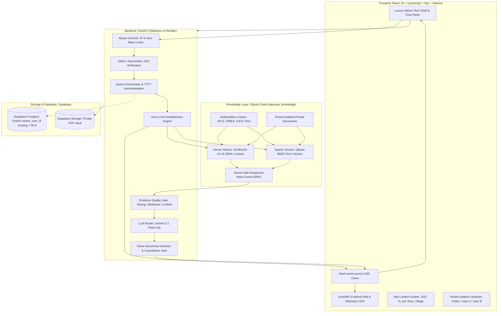

# 🌿 Darukaa.Earth — AI Biodiversity & Environmental Scientist

[](backend/tests/)
[](frontend/)
[](backend/src/retriever/)
[](backend/src/api/auth.py)
[](backend/src/generator/)

An enterprise-grade, evidence-grounded AI conversational intelligence platform built for **Darukaa.Earth**. Operating as an **AI Environmental Scientist**, this system translates complex ecological dynamics into audit-ready, scientific decision intelligence.

The platform couples an authoritative scientific knowledge layer in **Qdrant Cloud** with server-side hybrid retrieval (dense + BM25 sparse vectors via Reciprocal Rank Fusion), JWKS-verified Supabase JWT multi-tenant isolation for private documents, a deterministic multi-metric reasoning scaffold, an Evidence Quality assessment gate, and sub-second warm-target TTFT streaming over Server-Sent Events (SSE).

---

## 🌐 Live Production Deployments

| Component                 | Provider | Live URL                                                                      |
| ------------------------- | -------- | ----------------------------------------------------------------------------- |
| **Web Application** | Vercel   | [https://prakriti-ai-eta.vercel.app](https://prakriti-ai-eta.vercel.app)       |
| **Backend API**     | Render   | [https://prakriti-ai-jgsn.onrender.com](https://prakriti-ai-jgsn.onrender.com) |
| **Health Check**    | Render   | [`/health`](https://prakriti-ai-jgsn.onrender.com/health)                    |
| **Readiness Probe** | Render   | [`/ready`](https://prakriti-ai-jgsn.onrender.com/ready)                      |

---

## 🏛️ System Architecture



---

## 🔬 Core Engineering Innovations

### 1. Hybrid Retrieval Engine (Qdrant Server-Side RRF)

- Hosted in **Qdrant Cloud** cluster under collection `darukaa_knowledge` (`status: green`, **1,143 points / 1,144 vectors indexed**).
- Dual-vector indexing architecture:
  - **Dense Vectors:** 384-dimensional dense semantic vectors (`sentence-transformers/all-MiniLM-L6-v2`, Cosine distance) generated via FastEmbed.
  - **Sparse Vectors:** Native lexical BM25 vectors (`Qdrant/bm25`) for exact scientific terminology and numerical thresholds.
- Fuses top dense (20) and sparse (20) candidates server-side using Reciprocal Rank Fusion (`Fusion.RRF`).
- **Zero local compute overhead:** Ingested and queried with sub-second execution (~800ms) without in-memory `rank-bm25` bottlenecks.

### 2. Multi-Tenant Cryptographic Isolation

- **Strict Server-Side Identity:** User identity is strictly derived from verified Supabase JWT signatures (`sub` claim). Client-supplied `user_id` payloads are rejected and never trusted.
- **Immutable Visibility Filter:** Every single retrieval operation applies an immutable security filter:
  ```python
  (scope == "public") OR (scope == "private" AND owner_user_id == verified_user_id)
  ```
- **Fallback Invariant:** If specific topical queries yield zero results, topical filters may relax, but the **tenant visibility boundary is never relaxed**.
- **Synchronous Deletions:** Document deletion executes `qdrant.delete(..., wait=True)` ensuring instantaneous purge before database status updates.
- **IDOR Protection:** `GET /api/v1/sources/{id}` enforces strict ownership checks to prevent unauthorized access across tenants.

### 3. Conversational Intelligence & Reasoning

- **Zero-LLM Fast Clarification Filter:** When an intervention request lacks critical ecological variables (e.g. soil organic carbon %, rainfall, land use), the system triggers an immediate clarification event with targeted parameter questions in **sub-5ms without burning LLM tokens**.
- **Multi-Metric Causal Reasoning Scaffold:**

  - Ecological restoration queries explicitly connect $\ge 3$ environmental dimensions:

  > 🌾 **Tillage & Cover Crops** ➔ 💧 **Soil Carbon & Moisture Aggregation** ➔ 🐝 **Pollinator & Microbial Biodiversity**
  >

  - Conceptual queries (e.g., *"What is soil organic carbon?"*) provide direct, unforced scientific explanations without synthetic multi-metric extrapolation.
- **Evidence Quality Gate:** Qualitatively evaluates grounding (`Strong`, `Moderate`, `Limited`, `Insufficient`) based on source corroboration, provenance, and primary fieldwork.
- **Streaming Citation Integrity Audit:** Emits an authoritative pre-generation citation manifest `[S1]`, `[S2]`, ... in real-time. Post-stream audit verifies that no unlisted citations are cited by the LLM.

### 4. API Abuse Controls & Defense-in-Depth

- **Sliding-Window Rate Limiting:**
  - Anonymous requests: 5 req/min per IP address.
  - Authenticated requests: 20 req/min per verified `user_id`.
- **Input Quotas:** Max 1,000 characters for queries; max 25MB, max 100 pages, max 10 documents per user.
- **Client Disconnect Cancellation:** SSE streaming loop continuously checks `request.is_disconnected()` to abort upstream Gemini token generation immediately if the user closes or cancels the tab.

---

## 🎨 Luxury Nature-Tech UI/UX (Inspired by Darukaa.Earth)

- **Palette & Atmospheric Lighting:** Deep obsidian (`#040D09`, `#07130E`, `#0B1A14`), vivid emerald (`#009245`), and electric lime (`#A9EE70`, `#B6F07F`) highlights with subtle radial blur nebulae and geometric background grid.
- **Shell & Console Controls:** Mac OS traffic light status dots (`#FF5F57`, `#FEBC2E`, `#28C840`), monospace telemetry tags (`JetBrains Mono`, tracking `0.2em`), and live telemetry ticker (`1,143 pts Active • FastEmbed Hybrid RRF`).
- **Chat Command Center:** Hero empty state with scientific ground-truth badge, high-contrast typography, interactive benchmark cards with hover elevation and neon borders, and floating glassmorphic prompt dock.
- **Scientific Evidence Rail:** Real-time Telemetry HUD (Warm TTFT, RRF retrieval ms, SSE first write), animated Multi-Metric Causal Chain (`SOC 0.3% → Aggregation → Moisture → Pollinators`), and citation integrity checks.
- **Evidence Cards:** Glassmorphic cards with glowing electric lime citation IDs `[S1]`, organization badges (`IPCC`, `IPBES`, `IUCN`), expandable excerpt drawers, and direct DOI links.

---

## 📁 Repository Structure

```text
.
├── backend/
│   ├── requirements.txt            # Python dependencies (FastAPI, Qdrant, FastEmbed, PyMuPDF)
│   ├── scripts/
│   │   ├── seed_public_kb.py       # Seeds IPCC, IPBES, IUCN PDFs into Qdrant Cloud
│   │   └── test_qdrant_connection.py
│   ├── src/
│   │   ├── api/
│   │   │   ├── auth.py             # Supabase JWKS & Asymmetric JWT verification
│   │   │   ├── main.py             # FastAPI entrypoint, SSE streaming endpoints, CORS
│   │   │   ├── rate_limit.py       # Sliding-window rate limiter
│   │   │   ├── schemas.py          # Pydantic models for queries, context & citations
│   │   │   └── supabase_db.py      # Scoped Postgres persistence
│   │   ├── generator/
│   │   │   ├── llm_router.py       # Gemini 3.1 Flash-Lite router & fallback logic
│   │   │   ├── prompts.py          # Multi-metric causal reasoning system prompts
│   │   │   └── stream.py           # SSE event generation & disconnect detection
│   │   ├── ingestion/
│   │   │   ├── chunker.py          # Markdown/text sentence-aware chunking
│   │   │   ├── indexer.py          # Dense + BM25 batch indexing into Qdrant
│   │   │   ├── parser.py           # PyMuPDF parser with quota enforcement
│   │   │   └── sanitizer.py        # PII & prompt injection protection
│   │   ├── intelligence/
│   │   │   ├── completeness.py     # Zero-LLM Fast Clarification filter
│   │   │   └── evidence_gate.py    # Evidence Quality rating & citation integrity
│   │   └── retriever/
│   │       ├── embeddings.py       # FastEmbed dense (all-MiniLM-L6-v2) & sparse (BM25)
│   │       ├── hybrid_search.py    # Qdrant Reciprocal Rank Fusion (RRF) search
│   │       └── qdrant_store.py     # Qdrant Cloud client & schema management
│   └── tests/
│       ├── test_citations.py       # Manifest integrity & citation verification tests
│       ├── test_completeness.py    # Zero-LLM clarification trigger tests
│       ├── test_rate_limit.py      # Anonymous vs authenticated rate limiting tests
│       ├── test_security_isolation.py # Multi-tenant isolation & unsigned JWT tests
│       └── test_streaming.py       # SSE events & client disconnect tests
├── data/
│   └── corpus/                     # Authoritative public scientific PDFs
│       ├── IPBES_2018_Land_Degradation_and_Restoration_SPM.pdf
│       ├── IPBES_2019_Global_Biodiversity_Assessment_SPM.pdf
│       ├── IPCC_2019_Climate_Change_and_Land_SPM.pdf
│       └── IUCN_Global_Ecosystem_Typology_2.0.pdf
├── frontend/
│   ├── index.html                  # Google Fonts: Plus Jakarta Sans & JetBrains Mono
│   ├── package.json                # React 18, Vite, Tailwind CSS, Lucide icons
│   ├── src/
│   │   ├── App.tsx                 # App orchestration, user switching, SSE handling
│   │   ├── components/
│   │   │   ├── chat/               # ChatPanel, EnvironmentalContextModal
│   │   │   ├── evidence/           # EvidenceRail, EvidenceCard, Telemetry HUD
│   │   │   ├── layout/             # Shell, Sidebar, Tenant Switcher
│   │   │   └── uploads/            # DocumentManager (Private PDF Vault)
│   │   ├── index.css               # Luxury dark glassmorphism & typing animations
│   │   └── lib/                    # SSE streaming client & Supabase auth
│   └── tailwind.config.js          # Nature-tech dark palette & keyframes
├── render.yaml                     # Render backend blueprint specification
├── supabase_schema.sql             # Supabase Postgres tables & RLS security policies
└── vercel.json                     # Vercel SPA routing configuration
```

---

## 🛠️ Local Development Quickstart

### Prerequisites

- Python 3.11+
- Node.js 18+ and npm
- Qdrant Cloud cluster URL & API key
- Google Gemini API key
- Supabase Project URL & Anon/Service keys

### 1. Environment Setup

Copy the example environment file and fill in your credentials:

```bash
cp .env.example .env
```

### 2. Backend Setup

```bash
# Install Python dependencies
pip install -r backend/requirements.txt

# Run full test suite (11/11 tests)
python -m pytest backend/tests/ -v

# Seed the 4 authoritative public papers into Qdrant Cloud
python -m backend.scripts.seed_public_kb

# Start local FastAPI backend server
uvicorn backend.src.api.main:app --host 0.0.0.0 --port 8000 --reload
```

### 3. Frontend Setup

```bash
cd frontend

# Install Node dependencies
npm install

# Start Vite local development server
npm run dev

# Build production bundle
npm run build
```

---

## 🧪 Automated Test Suite

Run the full pytest suite to verify multi-tenant isolation, rate limiting, and zero-LLM clarification:

```bash
python -m pytest backend/tests/ -v
```

Expected output:

```text
backend/tests/test_citations.py::test_evidence_manifest_and_citation_verification PASSED [  9%]
backend/tests/test_completeness.py::test_zero_llm_clarification_trigger PASSED [ 18%]
backend/tests/test_completeness.py::test_sufficient_context_bypasses_clarification PASSED [ 27%]
backend/tests/test_completeness.py::test_conceptual_definition_bypasses_clarification PASSED [ 36%]
backend/tests/test_rate_limit.py::test_anonymous_ip_rate_limiting PASSED [ 45%]
backend/tests/test_rate_limit.py::test_authenticated_user_rate_limiting PASSED [ 54%]
backend/tests/test_security_isolation.py::test_query_and_ingestion_embedding_compatibility PASSED [ 63%]
backend/tests/test_security_isolation.py::test_multi_tenant_isolation_matrix PASSED [ 72%]
backend/tests/test_security_isolation.py::test_production_mode_rejects_unsigned_jwt PASSED [ 81%]
backend/tests/test_streaming.py::test_sse_stream_events PASSED           [ 90%]
backend/tests/test_streaming.py::test_client_disconnect_cancels_generation PASSED [100%]
======================= 11 passed in 17.30s ========================
```

---

## 🔒 Security Posture & Compliance

- **No Secret Leaks:** `.env` and sensitive API keys are strictly excluded via `.gitignore`. The client only holds the public `SUPABASE_ANON_KEY`.
- **Zero Synthetic Content:** Only genuine peer-reviewed scientific documents (IPCC, IPBES, IUCN) exist in `data/corpus/`.
- **Asymmetric Token Validation:** Render backend verifies cryptographic signatures using Supabase JWKS endpoints in production.
- **Fail-Safe Tenant Scoping:** Every database interaction is scoped to `owner_user_id` on both the client (via Row-Level Security) and the server (via direct parameter binding).

---

## 📄 License

MIT License. Built for **Darukaa.Earth**.
