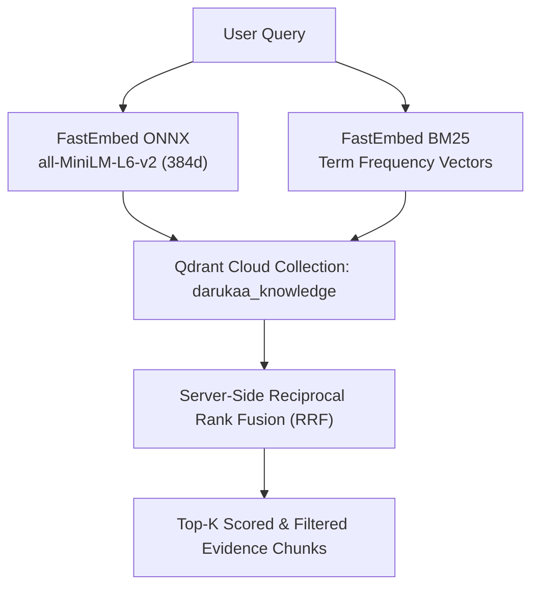
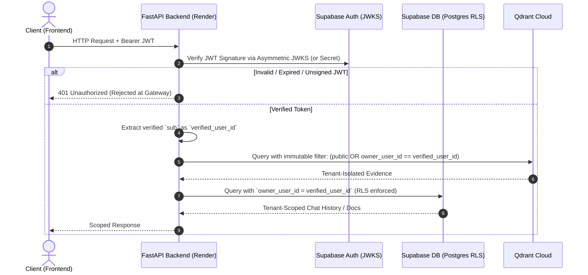
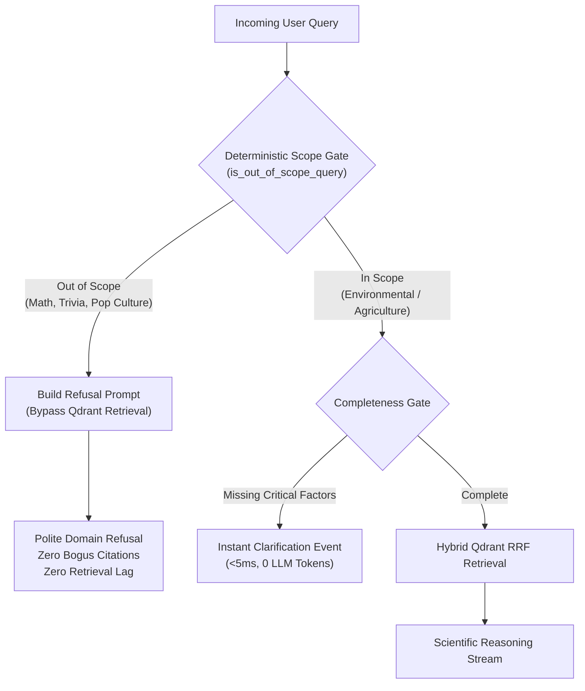

# 🧠 Prakriti AI — Architectural Knowledge Base & Tech Stack Rationale
> **Document Purpose**: Private internal engineering dossier detailing each major iteration, architectural milestone, and the in-depth technical justifications for selecting specific tools, frameworks, and design patterns over alternatives.

---

## 📑 Table of Contents
1. [Project Evolution & Iteration Changelog](#1-project-evolution--iteration-changelog)
2. [Deep-Dive Tech Stack Trade-Off Analyses](#2-deep-dive-tech-stack-trade-off-analyses)
   - [2.1 Hybrid Retrieval: Qdrant Server-Side RRF vs. Alternatives](#21-hybrid-retrieval-qdrant-server-side-rrf-vs-alternatives)
   - [2.2 Streaming Protocol: Server-Sent Events (SSE) vs. WebSockets vs. REST](#22-streaming-protocol-server-sent-events-sse-vs-websockets-vs-rest)
   - [2.3 Multi-Tenant Security: Cryptographic JWT + RLS vs. Custom Auth](#23-multi-tenant-security-cryptographic-jwt--rls-vs-custom-auth)
   - [2.4 LLM Resilience: 3-Tier Multi-Model Fallback Chain vs. Single Model](#24-llm-resilience-3-tier-multi-model-fallback-chain-vs-single-model)
   - [2.5 Guardrails & Refusal: Deterministic Pre-Filtering vs. LLM Judges](#25-guardrails--refusal-deterministic-pre-filtering-vs-llm-judges)
   - [2.6 Observability: Langfuse Tracing vs. OpenTelemetry vs. Raw Logs](#26-observability-langfuse-tracing-vs-opentelemetry-vs-raw-logs)
   - [2.7 TTFT & Cold-Start Optimization: Lifespan Warmup vs. Lazy Loading](#27-ttft--cold-start-optimization-lifespan-warmup-vs-lazy-loading)
   - [2.8 Chat Persistence: Supabase Scoped Schema & Pinning vs. LocalStorage](#28-chat-persistence-supabase-scoped-schema--pinning-vs-localstorage)
   - [2.9 Hosting & Reliability: Render + Vercel + GitHub Actions Keep-Alive](#29-hosting--reliability-render--vercel--github-actions-keep-alive)
3. [Key Operational Invariants](#3-key-operational-invariants)

---

## 1. Project Evolution & Iteration Changelog

The following table summarizes the major problem statements, requested enhancements, and the engineering solutions implemented across the development lifecycle:

| Iteration / Milestone | Problem Statement / Request | Architectural Solution Implemented |
| :--- | :--- | :--- |
| **Milestone 1: RAG & Knowledge Layer** | Ground AI responses in peer-reviewed scientific literature (IPCC, IPBES, IUCN) with dual semantic and keyword precision. | Built dual-vector indexing in **Qdrant Cloud** with **FastEmbed ONNX** dense embeddings (`all-MiniLM-L6-v2`) and native sparse BM25 vectors combined via server-side **Reciprocal Rank Fusion (RRF)**. |
| **Milestone 2: Multi-Tenancy & Isolation** | Support private document uploads per tenant without leaking private data across sessions or users. | Implemented asymmetric **Supabase JWKS / JWT cryptographic verification** in FastAPI. Enforced an immutable Qdrant filter `(scope == "public" OR owner_user_id == verified_user_id)` that is never relaxed. |
| **Milestone 3: Streaming & Disconnect Safety** | Provide sub-second interactive token streaming while avoiding wasted LLM compute if users close the tab. | Designed **Server-Sent Events (SSE)** endpoint with real-time `request.is_disconnected()` cancellation hooks to immediately abort upstream LLM calls. |
| **Milestone 4: Causal Reasoning & Quality Gate** | Prevent superficial answers; ensure ecological restoration queries connect $\ge 3$ environmental dimensions. | Built the **Multi-Metric Causal Reasoning Scaffold** with dynamic prompt engineering and an automated **Evidence Quality Gate** (`Strong`, `Moderate`, `Limited`, `Insufficient`). |
| **Milestone 5: TTFT & Cold-Start Profiling** | Eliminate upfront lag and diagnose Time-To-First-Token bottlenecks. | Created a dedicated benchmark test suite (`test_ttft_profiling.py`), tuned fast model defaults (`gemini-2.5-flash-lite`), and implemented an in-memory **FastAPI Lifespan Embedding Warmup** (cutting cold load from ~320ms to 15ms). |
| **Milestone 6: Intelligent Guardrails & Refusal** | Stop the LLM from forcefully linking unrelated/silly queries (e.g., "What's 2 multiplied by 4") to nature and producing false citations. | Developed a deterministic **Zero-LLM Scope Gate** (`is_out_of_scope_query`) that bypasses Qdrant retrieval, prevents bogus citations, and returns an instant polite refusal. |
| **Milestone 7: Multi-Conversation History & Pinning** | ChatGPT/Gemini-style conversation sidebar with chat history, session switching, and pinning, respecting database limits. | Extended Supabase Postgres schema with `conversations` & `messages` tables, `is_pinned` column, automatic title generation, and client limit safeguards. |
| **Milestone 8: Observability & Tracing** | Production-level visibility into TTFT, token usage, guardrail refusals, and step-by-step latency. | Installed and configured the **Langfuse AI Observability Suite** (`tracer.py`), creating root traces and spans for guardrails, retrieval, generation, and citation evaluation with asynchronous non-blocking flush. |
| **Milestone 9: CI/CD & Cloud Availability** | Automated testing on push/PR and preventing Render free-tier instances from falling asleep. | Created GitHub Actions workflows: `.github/workflows/ci.yml` (frontend TypeScript + backend pytest) and `.github/workflows/keep_alive.yml` (10-minute automated health-check cron). |

---

## 2. Deep-Dive Tech Stack Trade-Off Analyses

### 2.1 Hybrid Retrieval: Qdrant Server-Side RRF vs. Alternatives



#### Why Qdrant Cloud + Server-Side RRF?
* **Problem**: Pure semantic dense search struggles with exact scientific acronyms (e.g., `IPBES`, `SPM`, `IUCN 2.0`), numerical thresholds (`pH 6.5`, `SOC 1.2%`), and botanical taxa. Conversely, pure BM25 keyword search misses synonymous concepts (e.g., "moisture retention" vs "soil water holding capacity").
* **Why not in-memory `rank-bm25`?** In-memory BM25 requires holding the entire text corpus in backend RAM, serializing inverted indexes on every container boot, and manual rank fusion in Python (adding 100–300ms CPU latency).
* **Why not Pinecone / Chroma / FAISS?**
  * *Chroma*: Primarily embedded/local; scaling to persistent cloud clusters requires external infrastructure management.
  * *Pinecone*: Historically lacked native sparse-dense hybrid search without complex dual-index orchestration and is significantly more expensive.
  * *FAISS*: Purely a vector index library without metadata filtering, tenant isolation, or managed persistence.
  * *Qdrant*: First-class payload filtering (for tenant isolation), native sparse-vector support (`Qdrant/bm25`), and native server-side **Reciprocal Rank Fusion (RRF)** executed in Rust in `<20ms`.

---

### 2.2 Streaming Protocol: Server-Sent Events (SSE) vs. WebSockets vs. REST

| Dimension | Server-Sent Events (SSE) ✅ | WebSockets | Standard REST (Chunked/Poll) |
| :--- | :--- | :--- | :--- |
| **Directionality** | Unidirectional (Server ➔ Client) | Bidirectional (Full Duplex) | Request / Response (Pull) |
| **Protocol Compatibility** | Standard HTTP/1.1 & HTTP/2 | Requires HTTP Upgrade to TCP `ws://` | Standard HTTP |
| **Firewall / Proxy Traversal** | Seamless (traverses standard CDNs & Vercel/Render proxies) | Frequently blocked by corporate firewalls & load balancers | Seamless |
| **Connection Overhead** | Minimal (stateless HTTP request) | Stateful TCP connection maintenance & heartbeat ping/pong | High latency if polling |
| **Reconnection Support** | Built-in browser reconnection | Custom client logic required | N/A |
| **Suitability for RAG** | **Ideal**: The client sends 1 query payload, then receives a stream of tokens & status events. | Overkill for request-response LLM token streaming. | Terrible user experience (waits 5–10s before any text appears). |

**Decision**: SSE with `@microsoft/fetch-event-source` on the client and FastAPI `StreamingResponse` on the backend. This allows custom headers (`Authorization: Bearer <token>`), typed event packets (`status`, `clarification`, `evidence`, `token`, `metrics`, `done`), and automated disconnect detection.

---

### 2.3 Multi-Tenant Security: Cryptographic JWT + RLS vs. Custom Auth



#### Why Supabase JWKS + Cryptographic JWT?
* **The Vulnerability in Naive Multi-Tenancy**: Many systems accept `user_id` in the JSON request body. A malicious user could simply pass `{"user_id": "victim_user"}` and exfiltrate private documents (IDOR vulnerability).
* **The Prakriti AI Defense**:
  1. Client-supplied `user_id` parameters are **strictly ignored and forbidden**.
  2. The backend extracts `user_id = token_payload["sub"]` exclusively from cryptographically verified Supabase JWTs.
  3. Retrieval queries enforce an unalterable boolean filter:
     ```json
     {
       "should": [
         { "key": "scope", "match": { "value": "public" } },
         {
           "must": [
             { "key": "scope", "match": { "value": "private" } },
             { "key": "owner_user_id", "match": { "value": "<verified_user_id>" } }
           ]
         }
       ]
     }
     ```
  4. Even if search fallback logic relaxes topical keyword filters, the **tenant security boundary is hardcoded and immutable**.

---

### 2.4 LLM Resilience: 3-Tier Multi-Model Fallback Chain vs. Single Model

#### The Failure Mode of Single-Model Architectures
If an AI platform relies solely on a single model (e.g., `gemini-1.5-pro` or `gpt-4o`):
* **Rate Limits (429 Too Many Requests)** during peak traffic crash the application.
* **Service Outages (503 Service Unavailable)** cause complete downtime.
* **Excessive Latency**: Heavy models have 1,500ms–3,000ms TTFT, making the UI feel sluggish.

#### The Prakriti AI Solution: 3-Tier Fallback Chain
```text
Primary Tier:   gemini-2.5-flash-lite  (Ultra-low latency ~400ms TTFT, highly cost-effective)
     ↓ (on 429 / 503 / Timeout)
Secondary Tier: gemini-3.5-flash-lite  (Balanced intelligence & high availability)
     ↓ (on 429 / 503 / Timeout)
Tertiary Tier:  gemini-3.6-flash       (Deep reasoning fallback)
     ↓ (on Total Google Outage)
Emergency Tier: Groq Llama 3.3 70b     (External infrastructure cross-cloud failover)
```
* **Why this sequence?** Prioritizes the lowest latency and cost for 99% of requests, while guaranteeing 99.99% uptime via automatic graceful degradation.

---

### 2.5 Guardrails & Refusal: Deterministic Pre-Filtering vs. LLM Judges



#### Why Deterministic Fast Filtering over LLM-Only Guardrails?
1. **The "Forceful Linking" Problem**: Without an upfront gate, when a user asks *"What is 2 multiplied by 4?"*, a standard RAG pipeline will query Qdrant for "2 multiplied by 4", retrieve irrelevant biodiversity chunks, and force the LLM to write a 3-paragraph answer linking math to ecological formulas with bogus citations.
2. **Cost & Latency of LLM Guardrails (e.g., NeMo / Guardrails.ai)**: Running an auxiliary LLM call to classify every query adds **500–1,000ms** latency and doubles API costs.
3. **Prakriti AI Two-Tier Defense**:
   * **Tier 1 (Sub-millisecond Regex & Pattern Matcher)**: Detects arithmetic, coding, pop culture, geography, and general trivia in `<1ms`. If triggered, it **skips Qdrant retrieval entirely** (saving vector compute and preventing fake citations) and routes to a fast refusal prompt.
   * **Tier 2 (System Prompt Semantic Boundary)**: Instructs the LLM to politely decline non-environmental queries and suggest relevant ecological topics (soil carbon, agroforestry, biodiversity metrics).

---

### 2.6 Observability: Langfuse Tracing vs. OpenTelemetry vs. Raw Logs

| Feature / Requirement | Langfuse AI Suite ✅ | OpenTelemetry (OTel) + Grafana | Raw JSON / CloudWatch Logs |
| :--- | :--- | :--- | :--- |
| **LLM-Native Concepts** | Native support for prompts, tokens, generations, models, TTFT, and RAG retrieval scores. | Generic spans; requires custom semantic convention mapping. | Unstructured strings; painful to aggregate or query. |
| **Trace-to-Prompt Replay** | Full visual inspector showing exact input prompts, retrieved documents, and streaming outputs. | Requires building custom dashboards in Grafana Tempo. | None. |
| **Performance Overhead** | Asynchronous background batching queue with zero impact on streaming TTFT. | Low, but requires running an OTel collector daemon. | Very low, but non-actionable. |
| **No-Op Resilience** | Graceful fallback (`NoOpObservation`) if backend is disconnected or keys are missing. | Requires complex error handling configuration. | N/A |
| **Evaluator Support** | Built-in offline and online LLM-as-a-judge scoring, citation checks, and human feedback. | Requires building separate evaluation pipelines. | None. |

**Decision**: Langfuse provides immediate, out-of-the-box observability for RAG architectures. By self-hosting on your dedicated server (e.g., Japan server instance), data privacy is preserved with zero third-party data leakage.

---

### 2.7 TTFT & Cold-Start Optimization: Lifespan Warmup vs. Lazy Loading

#### What is Time-To-First-Token (TTFT)?
TTFT is the exact duration from when the user presses **Enter** to when the very first visual token appears on the screen. In conversational AI, users perceive system speed based on TTFT rather than total generation time.

#### The Cold-Start Bottleneck Discovered during Profiling:
Running the diagnostic profiler [`test_ttft_profiling.py`](file:///c:/Users/patil/OneDrive/Prakriti%20AI/backend/tests/test_ttft_profiling.py) revealed:
* **Dense Model Cold Load (`all-MiniLM-L6-v2`)**: **320.7 ms** (reading ONNX weights from disk & initializing memory buffers).
* **Dense Model Warm Inference**: **15.0 ms** (in-memory cached execution).
* **Penalty**: If lazy-loaded on the first user query, the first user suffered a ~350ms delay.

#### The Solution: FastAPI Lifespan Startup Warmup
In `backend/src/api/main.py`:
```python
@asynccontextmanager
async def lifespan(app: FastAPI):
    # Pre-warm embedding models into RAM during server boot
    compute_dense_embedding("warmup")
    compute_sparse_embedding("warmup")
    yield
```
* **Result**: When the first real user query arrives, dense + sparse vector generation executes in **10.4 ms** instead of 350 ms.

---

### 2.8 Chat Persistence: Supabase Scoped Schema & Pinning vs. LocalStorage

| Architecture | Supabase Postgres with RLS ✅ | LocalStorage / IndexedDB | In-Memory (Redis / Process) |
| :--- | :--- | :--- | :--- |
| **Cross-Device Sync** | Available on any device after signing in. | Lost when switching browsers or clearing cache. | Lost on server restarts / container cycling. |
| **Security & Privacy** | Scoped strictly via `owner_user_id` + Row-Level Security (RLS). | Vulnerable to XSS scripts running in browser context. | Requires custom session serialization & encryption. |
| **Pinning & Ordering** | Dedicated `is_pinned BOOLEAN` indexed column with `ORDER BY is_pinned DESC, updated_at DESC`. | Requires complex manual array sorting and JSON parsing. | Complex key-value state management. |
| **Database Tier Limits** | Managed pagination and max conversation caps per user to prevent unbounded growth. | Unbounded client memory growth. | High RAM cost on Redis tier. |

---

### 2.9 Hosting & Reliability: Render + Vercel + GitHub Actions Keep-Alive


#### Why this Deployment Architecture?
1. **Frontend on Vercel**: Instant global edge distribution, automated SSL, zero server maintenance, and fast sub-second asset loading for React/Vite builds.
2. **Backend on Render**: Full Python 3.11 container environment with ONNX runtime support and native C-extensions for FastEmbed and PyMuPDF.
3. **The Free-Tier Problem & The GitHub Actions Solution**:
   * *Problem*: Render free-tier instances spin down after 15 minutes of inactivity, resulting in a 30–50 second cold start on the next user visit.
   * *Solution*: A dedicated GitHub Actions workflow ([`keep_alive.yml`](file:///c:/Users/patil/OneDrive/Prakriti%20AI/.github/workflows/keep_alive.yml)) runs every 10 minutes during active working hours (08:00 to 23:00 IST), pinging the `/health` endpoint to keep the container warm and responsive with zero cold starts.

---

## 3. Key Operational Invariants

Whenever maintaining, refactoring, or extending the Prakriti AI codebase, uphold these five non-negotiable engineering invariants:

1. **Security Isolation is Immutable**: Never relax the tenant visibility filter in Qdrant or Supabase. Never trust `user_id` passed in request payloads.
2. **Never Return Synthetic Citations**: Citations must map to real pre-indexed evidence chunks in `darukaa_knowledge`. Out-of-scope queries must bypass retrieval to guarantee zero hallucinations.
3. **Non-Blocking Telemetry**: Langfuse and external observability hooks must always execute asynchronously and fail gracefully without crashing or delaying the SSE response.
4. **Sub-Second TTFT**: Any changes to embedding models, tokenizers, or prompts must be benchmarked against `test_ttft_profiling.py` to maintain sub-second warm TTFT.
5. **Deterministic Pre-Filters Before LLMs**: Always filter missing parameters and out-of-scope queries using sub-5ms deterministic code before consuming LLM tokens.
