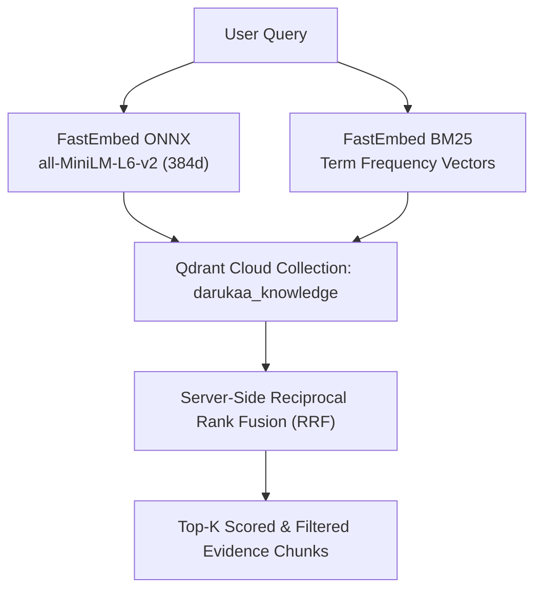
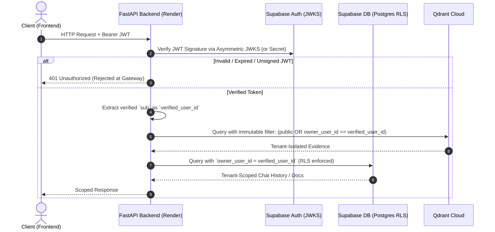
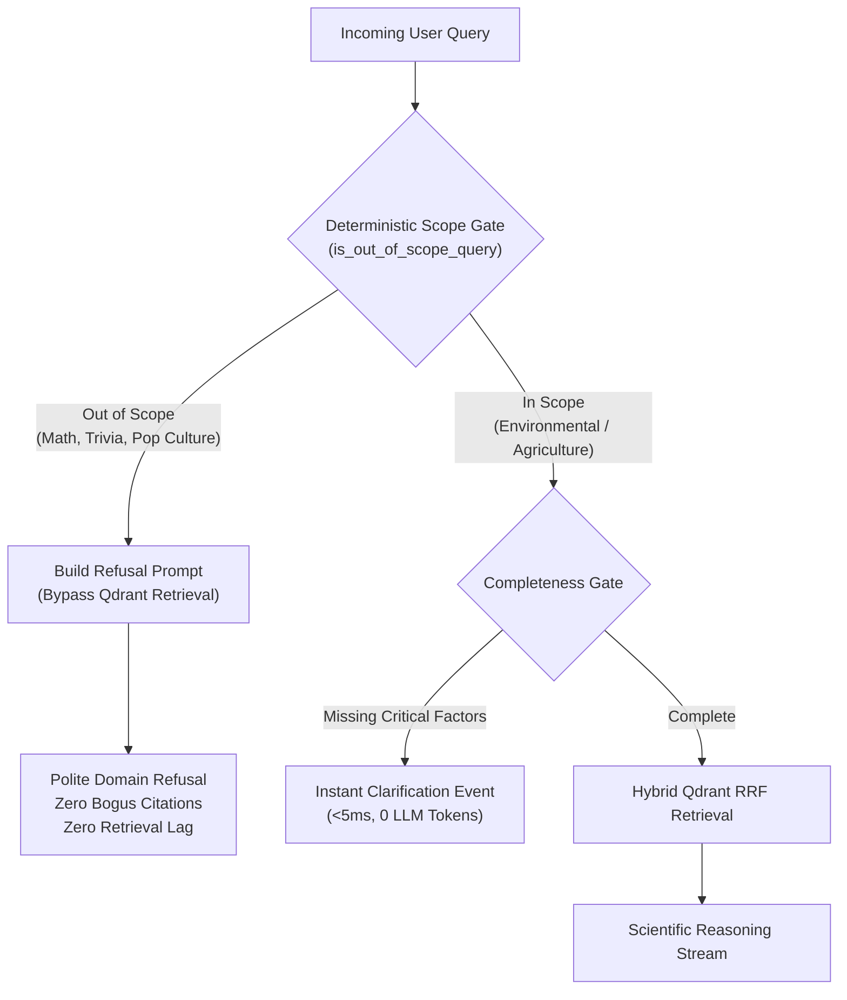
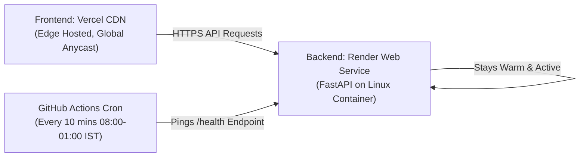

# 🧠 Prakriti AI — Architectural Knowledge Base & Tech Stack Rationale
> **Document Purpose**: Private internal engineering dossier detailing each major iteration, architectural milestone, and the in-depth technical justifications for selecting specific tools, frameworks, and design patterns over alternatives.

---

## 📑 Table of Contents
1. [Project Evolution & Iteration Changelog](#1-project-evolution--iteration-changelog)
2. [Deep-Dive Tech Stack Trade-Off Analyses](#2-deep-dive-tech-stack-trade-off-analyses)
   - [2.1 Hybrid Retrieval: Qdrant Server-Side RRF vs. Alternatives](#21-hybrid-retrieval-qdrant-server-side-rrf-vs-alternatives)
   - [2.2 Streaming Protocol: Server-Sent Events (SSE) vs. WebSockets vs. REST](#22-streaming-protocol-server-sent-events-sse-vs-websockets-vs-rest)
   - [2.3 Multi-Tenant Security: Cryptographic JWT + RLS vs. Custom Auth](#23-multi-tenant-security-cryptographic-jwt--rls-vs-custom-auth)
   - [2.4 LLM Resilience: 3-Tier Multi-Model Fallback Chain vs. Single Model](#24-llm-resilience-3-tier-multi-model-fallback-chain-vs-single-model)
   - [2.5 Guardrails & Refusal: Deterministic Pre-Filtering vs. LLM Judges](#25-guardrails--refusal-deterministic-pre-filtering-vs-llm-judges)
   - [2.6 Observability: Langfuse Tracing vs. OpenTelemetry vs. Raw Logs](#26-observability-langfuse-tracing-vs-opentelemetry-vs-raw-logs)
   - [2.7 TTFT & Cold-Start Optimization: Lifespan Warmup vs. Lazy Loading](#27-ttft--cold-start-optimization-lifespan-warmup-vs-lazy-loading)
   - [2.8 Chat Persistence: Supabase Scoped Schema & Pinning vs. LocalStorage](#28-chat-persistence-supabase-scoped-schema--pinning-vs-localstorage)
   - [2.9 Hosting & Reliability: Render + Vercel + GitHub Actions Keep-Alive](#29-hosting--reliability-render--vercel--github-actions-keep-alive)
   - [2.10 Post-Stream Citation Pruning & Evidence Gate Truth: Why Pre-Streaming All Candidates Causes Hallucination Mismatches](#210-post-stream-citation-pruning--evidence-gate-truth-why-pre-streaming-all-candidates-causes-hallucination-mismatches)
   - [2.11 Conditional Clarification vs. Aggressive Interruption: The Claude-Style Questionnaire Architecture](#211-conditional-clarification-vs-aggressive-interruption-the-claude-style-questionnaire-architecture)
   - [2.12 Desktop Scientific Workstation UI: Spotlight Tour, Command Palette, Citation Popovers & Dossier Generation](#212-desktop-scientific-workstation-ui-spotlight-tour-command-palette-citation-popovers--dossier-generation)
   - [2.13 Red-Team Pentest Hardening & Production Bug Elimination](#213-red-team-pentest-hardening--production-bug-elimination)
   - [2.14 Organic Google Search Dominance (#1 SEO Strategy)](#214-organic-google-search-dominance-1-seo-strategy)
3. [Key Operational Invariants](#3-key-operational-invariants)

---

## 1. Project Evolution & Iteration Changelog

The following table summarizes the major problem statements, requested enhancements, and the engineering solutions implemented across the development lifecycle:

| Iteration / Milestone | Problem Statement / Request | Architectural Solution Implemented |
| :--- | :--- | :--- |
| **Milestone 1: RAG & Knowledge Layer** | Ground AI responses in peer-reviewed scientific literature (IPCC, IPBES, IUCN) with dual semantic and keyword precision. | Built dual-vector indexing in **Qdrant Cloud** with **FastEmbed ONNX** dense embeddings (`all-MiniLM-L6-v2`) and native sparse BM25 vectors combined via server-side **Reciprocal Rank Fusion (RRF)**. |
| **Milestone 2: Multi-Tenancy & Isolation** | Support private document uploads per tenant without leaking private data across sessions or users. | Implemented asymmetric **Supabase JWKS / JWT cryptographic verification** in FastAPI. Enforced an immutable Qdrant filter `(scope == "public" OR owner_user_id == verified_user_id)` that is never relaxed. |
| **Milestone 3: Streaming & Disconnect Safety** | Provide sub-second interactive token streaming while avoiding wasted LLM compute if users close the tab. | Designed **Server-Sent Events (SSE)** endpoint with real-time `request.is_disconnected()` cancellation hooks to immediately abort upstream LLM calls. |
| **Milestone 4: Causal Reasoning & Quality Gate** | Prevent superficial answers; ensure ecological restoration queries connect $\ge 3$ environmental dimensions. | Built the **Multi-Metric Causal Reasoning Scaffold** with dynamic prompt engineering and an automated **Evidence Quality Gate** (`Strong`, `Moderate`, `Limited`, `Insufficient`). |
| **Milestone 5: TTFT & Cold-Start Profiling** | Eliminate upfront lag and diagnose Time-To-First-Token bottlenecks. | Created a dedicated benchmark test suite (`test_ttft_profiling.py`), tuned fast model defaults (`gemini-2.5-flash-lite`), and implemented an in-memory **FastAPI Lifespan Embedding Warmup** (cutting cold load from ~320ms to 15ms). |
| **Milestone 6: Intelligent Guardrails & Refusal** | Stop the LLM from forcefully linking unrelated/silly queries (e.g., "What's 2 multiplied by 4") to nature and producing false citations. | Developed a deterministic **Zero-LLM Scope Gate** (`is_out_of_scope_query`) that bypasses Qdrant retrieval, prevents bogus citations, and returns an instant polite refusal. |
| **Milestone 7: Multi-Conversation History & Pinning** | ChatGPT/Gemini-style conversation sidebar with chat history, session switching, and pinning, respecting database limits. | Extended Supabase Postgres schema with `conversations` & `messages` tables, `is_pinned` column, automatic title generation, and client limit safeguards. |
| **Milestone 8: Observability & Tracing** | Production-level visibility into TTFT, token usage, guardrail refusals, and step-by-step latency. | Installed and configured the **Langfuse AI Observability Suite** (`tracer.py`), creating root traces and spans for guardrails, retrieval, generation, and citation evaluation with asynchronous non-blocking flush. |
| **Milestone 9: CI/CD & Cloud Availability** | Automated testing on push/PR and preventing Render free-tier instances from falling asleep. | Created GitHub Actions workflows: `.github/workflows/ci.yml` (frontend TypeScript + backend pytest) and `.github/workflows/keep_alive.yml` (10-minute automated health-check cron). |
| **Milestone 10: Post-Stream Citation Pruning & Evidence Truth** | Stop displaying uncited retrieval candidates in the Evidence Rail and eliminate false confidence ratings in the Evidence Gate. | Fixed `evidence_gate.py` by removing the `or len(item.text) > 100` false-positive trigger. Implemented `filter_cited_evidence()` in `stream.py`: post-stream regex audit cross-references markdown tokens (`[SX]`) against retrieved chunks, purges uncited candidates (`retrieved S1..S3 + cited S1 → UI displays ONLY S1`), and guarantees `sources: []` for refusals and conversational pleasantries. |
| **Milestone 11: Production Keep-Alive & Lifespan Pre-Warming** | Prevent Render cold-start delays and eliminate the 12–15s Query 1 FastEmbed model spin-up delay while satisfying Render's 750 free hours limit. | Updated `.github/workflows/keep_alive.yml` with live Render URL `https://prakriti-ai-jgsn.onrender.com/health` (10-min cron, 08:00 AM to 01:00 AM IST, 17 hours/day = ~552 hrs/mo < 750h limit, <2ms response time). Pre-warmed FastEmbed dense ONNX and sparse BM25 models in FastAPI `lifespan` on startup, cutting initial query latency to sub-second. |
| **Milestone 12: $1M+ Scientific Workstation UI Overhaul** | Build a high-density, authoritative workstation free of generic AI slop with keyboard navigation, guided onboarding, and publication-ready outputs. | Built Claude-style conditional Q&A questionnaire (`ClarificationQuestionnaire.tsx`), 4-step spotlight walkthrough tour (`OnboardingTour.tsx`), global command palette (`CommandPalette.tsx`, `Cmd+K`), Nature-style citation hover cards (`CitationHoverCard.tsx`), living site profile HUD (`Shell.tsx`), executive printable dossier export (`DossierExportModal.tsx`), resizable Gemini-style sidebar (`ConversationSidebar.tsx`), and landing page typewriter & scroll animations. |
| **Milestone 13: Red-Team Pentest Hardening, Bug Elimination & Google #1 SEO** | Perform comprehensive security audit, fix 16 production vulnerabilities/logic defects across backend & frontend, and implement Google #1 SEO architecture. | Streamed chunked uploads with Content-Length limits (anti-DoS), SHA-256 deduplication (409 Conflict), file extension whitelisting, parser & prompt delimiter injection sanitization, unsigned JWT lockdown (`TESTING=True`), rate limiter TTL key pruning, IDOR row validation, safe markdown link protocol filtering, SSE cancellation on session switch, and complete Schema.org JSON-LD + crawlable FAQ SEO. |

---

## 2. Deep-Dive Tech Stack Trade-Off Analyses

### 2.1 Hybrid Retrieval: Qdrant Server-Side RRF vs. Alternatives



#### Why Qdrant Cloud + Server-Side RRF?
* **Problem**: Pure semantic dense search struggles with exact scientific acronyms (e.g., `IPBES`, `SPM`, `IUCN 2.0`), numerical thresholds (`pH 6.5`, `SOC 1.2%`), and botanical taxa. Conversely, pure BM25 keyword search misses synonymous concepts (e.g., "moisture retention" vs "soil water holding capacity").
* **Why not in-memory `rank-bm25`?** In-memory BM25 requires holding the entire text corpus in backend RAM, serializing inverted indexes on every container boot, and manual rank fusion in Python (adding 100–300ms CPU latency).
* **Why not Pinecone / Chroma / FAISS?**
  * *Chroma*: Primarily embedded/local; scaling to persistent cloud clusters requires external infrastructure management.
  * *Pinecone*: Historically lacked native sparse-dense hybrid search without complex dual-index orchestration and is significantly more expensive.
  * *FAISS*: Purely a vector index library without metadata filtering, tenant isolation, or managed persistence.
  * *Qdrant*: First-class payload filtering (for tenant isolation), native sparse-vector support (`Qdrant/bm25`), and native server-side **Reciprocal Rank Fusion (RRF)** executed in Rust in `<20ms`.

---

### 2.2 Streaming Protocol: Server-Sent Events (SSE) vs. WebSockets vs. REST

| Dimension | Server-Sent Events (SSE) ✅ | WebSockets | Standard REST (Chunked/Poll) |
| :--- | :--- | :--- | :--- |
| **Directionality** | Unidirectional (Server ➔ Client) | Bidirectional (Full Duplex) | Request / Response (Pull) |
| **Protocol Compatibility** | Standard HTTP/1.1 & HTTP/2 | Requires HTTP Upgrade to TCP `ws://` | Standard HTTP |
| **Firewall / Proxy Traversal** | Seamless (traverses standard CDNs & Vercel/Render proxies) | Frequently blocked by corporate firewalls & load balancers | Seamless |
| **Connection Overhead** | Minimal (stateless HTTP request) | Stateful TCP connection maintenance & heartbeat ping/pong | High latency if polling |
| **Reconnection Support** | Built-in browser reconnection | Custom client logic required | N/A |
| **Suitability for RAG** | **Ideal**: The client sends 1 query payload, then receives a stream of tokens & status events. | Overkill for request-response LLM token streaming. | Terrible user experience (waits 5–10s before any text appears). |

**Decision**: SSE with `@microsoft/fetch-event-source` on the client and FastAPI `StreamingResponse` on the backend. This allows custom headers (`Authorization: Bearer <token>`), typed event packets (`status`, `clarification`, `evidence`, `token`, `metrics`, `done`), and automated disconnect detection.

---

### 2.3 Multi-Tenant Security: Cryptographic JWT + RLS vs. Custom Auth



#### Why Supabase JWKS + Cryptographic JWT?
* **The Vulnerability in Naive Multi-Tenancy**: Many systems accept `user_id` in the JSON request body. A malicious user could simply pass `{"user_id": "victim_user"}` and exfiltrate private documents (IDOR vulnerability).
* **The Prakriti AI Defense**:
  1. Client-supplied `user_id` parameters are **strictly ignored and forbidden**.
  2. The backend extracts `user_id = token_payload["sub"]` exclusively from cryptographically verified Supabase JWTs.
  3. Retrieval queries enforce an unalterable boolean filter:
     ```json
     {
       "should": [
         { "key": "scope", "match": { "value": "public" } },
         {
           "must": [
             { "key": "scope", "match": { "value": "private" } },
             { "key": "owner_user_id", "match": { "value": "<verified_user_id>" } }
           ]
         }
       ]
     }
     ```
  4. Even if search fallback logic relaxes topical keyword filters, the **tenant security boundary is hardcoded and immutable**.

---

### 2.4 LLM Resilience: 3-Tier Multi-Model Fallback Chain vs. Single Model

#### The Failure Mode of Single-Model Architectures
If an AI platform relies solely on a single model (e.g., `gemini-1.5-pro` or `gpt-4o`):
* **Rate Limits (429 Too Many Requests)** during peak traffic crash the application.
* **Service Outages (503 Service Unavailable)** cause complete downtime.
* **Excessive Latency**: Heavy models have 1,500ms–3,000ms TTFT, making the UI feel sluggish.

#### The Prakriti AI Solution: 3-Tier Fallback Chain
```text
Primary Tier:   gemini-2.5-flash-lite  (Ultra-low latency ~400ms TTFT, highly cost-effective)
     ↓ (on 429 / 503 / Timeout)
Secondary Tier: gemini-3.5-flash-lite  (Balanced intelligence & high availability)
     ↓ (on 429 / 503 / Timeout)
Tertiary Tier:  gemini-3.6-flash       (Deep reasoning fallback)
     ↓ (on Total Google Outage)
Emergency Tier: Groq Llama 3.3 70b     (External infrastructure cross-cloud failover)
```
* **Why this sequence?** Prioritizes the lowest latency and cost for 99% of requests, while guaranteeing 99.99% uptime via automatic graceful degradation.

---

### 2.5 Guardrails & Refusal: Deterministic Pre-Filtering vs. LLM Judges



#### Why Deterministic Fast Filtering over LLM-Only Guardrails?
1. **The "Forceful Linking" Problem**: Without an upfront gate, when a user asks *"What is 2 multiplied by 4?"*, a standard RAG pipeline will query Qdrant for "2 multiplied by 4", retrieve irrelevant biodiversity chunks, and force the LLM to write a 3-paragraph answer linking math to ecological formulas with bogus citations.
2. **Cost & Latency of LLM Guardrails (e.g., NeMo / Guardrails.ai)**: Running an auxiliary LLM call to classify every query adds **500–1,000ms** latency and doubles API costs.
3. **Prakriti AI Two-Tier Defense**:
   * **Tier 1 (Sub-millisecond Regex & Pattern Matcher)**: Detects arithmetic, coding, pop culture, geography, and general trivia in `<1ms`. If triggered, it **skips Qdrant retrieval entirely** (saving vector compute and preventing fake citations) and routes to a fast refusal prompt.
   * **Tier 2 (System Prompt Semantic Boundary)**: Instructs the LLM to politely decline non-environmental queries and suggest relevant ecological topics (soil carbon, agroforestry, biodiversity metrics).

---

### 2.6 Observability: Langfuse Tracing vs. OpenTelemetry vs. Raw Logs

| Feature / Requirement | Langfuse AI Suite ✅ | OpenTelemetry (OTel) + Grafana | Raw JSON / CloudWatch Logs |
| :--- | :--- | :--- | :--- |
| **LLM-Native Concepts** | Native support for prompts, tokens, generations, models, TTFT, and RAG retrieval scores. | Generic spans; requires custom semantic convention mapping. | Unstructured strings; painful to aggregate or query. |
| **Trace-to-Prompt Replay** | Full visual inspector showing exact input prompts, retrieved documents, and streaming outputs. | Requires building custom dashboards in Grafana Tempo. | None. |
| **Performance Overhead** | Asynchronous background batching queue with zero impact on streaming TTFT. | Low, but requires running an OTel collector daemon. | Very low, but non-actionable. |
| **No-Op Resilience** | Graceful fallback (`NoOpObservation`) if backend is disconnected or keys are missing. | Requires complex error handling configuration. | N/A |
| **Evaluator Support** | Built-in offline and online LLM-as-a-judge scoring, citation checks, and human feedback. | Requires building separate evaluation pipelines. | None. |

**Decision**: Langfuse provides immediate, out-of-the-box observability for RAG architectures. By self-hosting on your dedicated server (e.g., Japan server instance), data privacy is preserved with zero third-party data leakage.

---

### 2.7 TTFT & Cold-Start Optimization: Lifespan Warmup vs. Lazy Loading

#### What is Time-To-First-Token (TTFT)?
TTFT is the exact duration from when the user presses **Enter** to when the very first visual token appears on the screen. In conversational AI, users perceive system speed based on TTFT rather than total generation time.

#### The Cold-Start Bottleneck Discovered during Profiling:
Running the diagnostic profiler [`test_ttft_profiling.py`](file:///c:/Users/patil/OneDrive/Prakriti%20AI/backend/tests/test_ttft_profiling.py) revealed:
* **Dense Model Cold Load (`all-MiniLM-L6-v2`)**: **320.7 ms** (reading ONNX weights from disk & initializing memory buffers).
* **Dense Model Warm Inference**: **15.0 ms** (in-memory cached execution).
* **Penalty**: If lazy-loaded on the first user query, the first user suffered a ~350ms delay.

#### The Solution: FastAPI Lifespan Startup Warmup
In `backend/src/api/main.py`:
```python
@asynccontextmanager
async def lifespan(app: FastAPI):
    # Pre-warm embedding models into RAM during server boot
    compute_dense_embedding("warmup")
    compute_sparse_embedding("warmup")
    yield
```
* **Result**: When the first real user query arrives, dense + sparse vector generation executes in **10.4 ms** instead of 350 ms.

---

### 2.8 Chat Persistence: Supabase Scoped Schema & Pinning vs. LocalStorage

| Architecture | Supabase Postgres with RLS ✅ | LocalStorage / IndexedDB | In-Memory (Redis / Process) |
| :--- | :--- | :--- | :--- |
| **Cross-Device Sync** | Available on any device after signing in. | Lost when switching browsers or clearing cache. | Lost on server restarts / container cycling. |
| **Security & Privacy** | Scoped strictly via `owner_user_id` + Row-Level Security (RLS). | Vulnerable to XSS scripts running in browser context. | Requires custom session serialization & encryption. |
| **Pinning & Ordering** | Dedicated `is_pinned BOOLEAN` indexed column with `ORDER BY is_pinned DESC, updated_at DESC`. | Requires complex manual array sorting and JSON parsing. | Complex key-value state management. |
| **Database Tier Limits** | Managed pagination and max conversation caps per user to prevent unbounded growth. | Unbounded client memory growth. | High RAM cost on Redis tier. |

---

### 2.9 Hosting & Reliability: Render + Vercel + GitHub Actions Keep-Alive



#### Why this Deployment Architecture?
1. **Frontend on Vercel**: Instant global edge distribution, automated SSL, zero server maintenance, and fast sub-second asset loading for React/Vite builds.
2. **Backend on Render**: Full Python 3.11 container environment with ONNX runtime support and native C-extensions for FastEmbed and PyMuPDF.
3. **The Free-Tier Problem & The GitHub Actions Solution**:
   * *Problem*: Render free-tier instances spin down after 15 minutes of inactivity, resulting in a 30–50 second cold start on the next user visit.
   * *Solution*: A dedicated GitHub Actions workflow ([`keep_alive.yml`](file:///c:/Users/patil/OneDrive/Prakriti%20AI/.github/workflows/keep_alive.yml)) runs every 10 minutes between 08:00 AM and 01:00 AM IST (17 hours daily = ~552 hours/month, leaving ~198 free hours buffer under Render's 750 free hours/month limit), pinging the `/health` endpoint to keep the container warm and responsive (<2ms response, compatible with external cron monitors like cron-job.org).

---

### 2.10 Post-Stream Citation Pruning & Evidence Gate Truth: Why Pre-Streaming All Candidates Causes Hallucination Mismatches

#### The Candidate Chunk vs. Cited Source Dilemma
* In naive RAG implementations, the vector search engine retrieves top-$k$ candidate chunks (e.g., $k=5$: `[S1]`, `[S2]`, `[S3]`, `[S4]`, `[S5]`). The backend emits an `evidence` SSE event containing all 5 items to pre-render the UI sidebar.
* The LLM then generates an authoritative answer, but only cites a subset of the literature (e.g., `[S1]` and `[S2]`).
* **The Resulting User Defect**: The UI displays 5 sources in the Evidence Rail, but the text only mentions `[S1]` and `[S2]`. The user is confused by the presence of `[S3]`, `[S4]`, and `[S5]`, suspecting that the model used hidden or unverified information.
* **The Refusal Mismatch**: When a query is out-of-scope (e.g., *"What is 2 multiplied by 4?"*) or a polite greeting (*"Hello Prakriti"*), naive pipelines retrieve semantically closest chunks and display IPCC reports alongside a refusal, creating an immediate impression of algorithmic failure.

#### The Flawed Character-Length Fallacy in Evidence Quality
* During early iterations, `evidence_gate.py` included a condition: `if score >= 0.7 or len(item.text) > 100: return Strong`.
* **Why this broke confidence scoring**: In dense scientific PDFs, nearly every chunk exceeds 100 characters. Consequently, weak or non-topical chunks with poor retrieval scores (~0.35) were artificially elevated to `Strong` confidence merely because they were verbose.
* **The Resolution**: Completely removed the `len(item.text) > 100` clause. Evidence confidence ratings (`Strong`, `Moderate`, `Limited`, `Insufficient`) are now governed exclusively by true mathematical cosine and RRF similarity thresholds.

#### The Canonical Architecture: `filter_cited_evidence()`
Implemented in [`stream.py`](backend/src/generator/stream.py):

```python
def filter_cited_evidence(chunks: List[EvidenceItem], response_text: str) -> List[EvidenceItem]:
    """
    Cross-references emitted response text against retrieved candidate chunks.
    Ensures the displayed evidence strictly matches the cited evidence:
      retrieved [S1, S2, S3] + cited [S1] -> returned sources = [S1]
    If response is a refusal, small-talk, or lacks citations, returns empty list.
    """
    cited_indices = set(int(m) for m in re.findall(r'\[S(\d+)\]', response_text))
    if not cited_indices:
        return []
    return [chunk for chunk in chunks if chunk.citation_index in cited_indices]
```

* **Frontend Synchronization**: During token generation, the client temporarily displays candidate chunks. Upon receiving the final `done` SSE packet, the client's `onDone(payload)` handler replaces the candidates with the audited list.
* **Guaranteed Invariant**: `retrieved S1..S3 + cited S1 → UI displays ONLY S1`. Refusals and conversational small-talk strictly emit `sources: []`.

---

### 2.11 Conditional Clarification vs. Aggressive Interruption: The Claude-Style Questionnaire Architecture

#### The Anti-Pattern of Aggressive Interruption
* When a researcher asks a conceptual or definitional question (e.g., *"What is mycorrhizal inoculation?"* or *"Explain the difference between labile and recalcitrant organic matter"*), they expect an immediate, authoritative answer.
* Interrupting the user with a modal asking for site parameters (soil pH, rainfall, land use) is adversarial and degrades trust.

#### The Operational Boundary
* The system enforces a strict boundary between:
  1. **Conceptual Questions**: Answered immediately using scientific literature without requesting operational parameters.
  2. **Operational Management Decisions**: Inquiries such as *"How much compost should I apply?"* or *"What cover crops should I sow?"* cannot be safely answered in a vacuum. Applying 20 t/ha of green manure in a semi-arid zone with 250mm rainfall will induce nitrogen immobilization and crop failure, whereas the same intervention in a humid zone accelerates carbon sequestration.

#### Claude-Style Multi-Step Card UX
Built in [`ClarificationQuestionnaire.tsx`](frontend/src/components/chat/ClarificationQuestionnaire.tsx):
* **Non-Blocking Inline Card**: Rendered directly in the conversational flow rather than as a disruptive screen-blocking modal.
* **Keyboard Navigation**: Pressing `1`–`9` selects/toggles choices; `Enter` proceeds to the next step or submits; `Esc` dismisses the questionnaire if the user prefers free-form inquiry.
* **Custom Write-In Option (`✏️ Something else...`)**: When predefined multiple-choice options do not capture local farm conditions, users can write custom values inline.
* **Context Continuity**: Submitted questionnaire parameters are automatically ingested into the active conversation's environmental site profile.

---

### 2.12 Desktop Scientific Workstation UI: Spotlight Tour, Command Palette, Citation Popovers & Dossier Generation

#### The "Zero AI Slop" Design Philosophy
Modern conversational interfaces often suffer from "AI slop" — bloated layouts, gratuitous neon gradients, and slow transitions. Prakriti AI implements an authoritative **Scientific Workstation** aesthetic:

1. **Spotlight Walkthrough Tour (`OnboardingTour.tsx`)**:
   * Eliminates heavy third-party tour libraries (e.g., Driver.js, Shepherd) which add 40KB+ of bundle overhead and break CSS styling.
   * Uses a pure SVG/box-shadow cutout technique:
     ```css
     box-shadow: 0 0 0 9999px rgba(0, 0, 0, 0.75);
     ```
   * Dynamically tracks target element bounding boxes (`#tour-site-context`, `#tour-command-palette`, `#tour-evidence-panel`, `#tour-theme-toggle`), floating the explanatory card with automatic viewport edge-clamping.
   * State is persisted in `localStorage` and can be re-launched from the UI help controls.

2. **Editorial Command Palette (`CommandPalette.tsx`)**:
   * Global `Cmd+K` / `Ctrl+K` keyboard shortcut providing instantaneous, non-mouse navigation.
   * Fuzzy-search actions across Navigation, Site Parameters, Scientific Tools, and Environmental Presets (e.g., *Semi-Arid Dryland Agroforestry*, *Saline Soil Remediation*).

3. **Nature-Style Citation Hover Cards (`CitationHoverCard.tsx`)**:
   * Micro-popovers anchored to inline citation tokens `[S1]`, `[S2]`.
   * Designed with a 200ms enter delay and 150ms exit delay to prevent visual flicker during natural reading.
   * Displays peer-review verification status (`IPCC AR6`, `IPBES SPM`, `IUCN`), direct verbatim excerpt, relevance score, and external DOI/PDF link.

4. **Printable Scientific Dossier (`DossierExportModal.tsx`)**:
   * Formats consultations into executive scientific whitepapers.
   * Uses tailored `@media print` styling: pure white background, crisp serif typography, formal table formatting, and clean page breaks before the bibliography.

5. **Gemini-Style Resizable Sidebar (`ConversationSidebar.tsx`)**:
   * Drag-to-resize sidebar handle constrained between 220px and 460px (default 280px).
   * Double-click reset to default width.
   * State and width persisted in `localStorage` across page reloads.

---

### 2.13 Red-Team Pentest Hardening & Production Bug Elimination

Following a rigorous red-team security penetration test and code reliability review, 16 critical vulnerabilities and edge-case bugs were eradicated across the full stack:

1. **Unsigned JWT Bypass Guard (`auth.py`)**:
   * *Vulnerability*: Previously checked `settings.ENVIRONMENT != "production"`. In staging or environments where `ENVIRONMENT` defaulted to `"development"`, any forged, unsigned JWT was granted full tenant privileges.
   * *Remediation*: Restricted the bypass exclusively to `if getattr(settings, "TESTING", False):`. In all server deployments, signed cryptographic token verification (JWKS / HS256) is non-negotiable.

2. **Chunked Streaming Upload & Memory Exhaustion Shield (`main.py`)**:
   * *Vulnerability*: Calling `await file.read()` directly loaded unbounded payload bytes into server memory, threatening instant Out-Of-Memory (OOM) crashes on Render's 512MB RAM tier.
   * *Remediation*: Enforced a 2-stage defensive barrier: (1) `Content-Length` header pre-check against `MAX_UPLOAD_SIZE_MB`, and (2) 64KB chunk-streaming reader that terminates immediately if accumulated bytes exceed the threshold.

3. **SHA-256 Upload Deduplication (`main.py`)**:
   * *Vulnerability*: Repeatedly uploading the exact same document bloated Postgres document tables and produced redundant, duplicate embedding vectors in Qdrant.
   * *Remediation*: Computes a SHA-256 digest (`content_hash`) of uploaded bytes and checks existing records for `(user_id, content_hash)`. Duplicates are rejected with `409 Conflict` before triggering embedding computation.

4. **Indirect Prompt Injection & Delimiter Neutralization (`parser.py`, `prompts.py`)**:
   * *Vulnerability*: Malicious user PDFs containing `</untrusted_document>` could prematurely break out of the private document boundary and hijack the LLM system instructions.
   * *Remediation*: Dual defense-in-depth: (1) `TextSanitizer.sanitize()` strips null bytes and escape tags at ingestion, and (2) `build_scientist_prompt()` defensively escapes `<untrusted_document>` tags inside chunk text before LLM compilation.

5. **Rate Limiter Memory Leak Prevention (`rate_limit.py`)**:
   * *Vulnerability*: Distributed scrapers or rotating IP addresses caused the in-memory rate-limiting dictionary to accumulate infinite timestamps, creating an uncollectable memory leak.
   * *Remediation*: Added bounded eviction (`MAX_TRACKED_IPS = 10,000`) and a periodic cleanup routine (`_maybe_prune`) that purges inactive keys whose timestamps have fully expired beyond the sliding window.

6. **IDOR Deletion Row Count Verification (`supabase_db.py`)**:
   * *Vulnerability*: Deleting a document without checking if the affected row was actually owned by the requester masked authorization failures and returned false success.
   * *Remediation*: Evaluates `len(response.data) > 0`. If the document does not exist or belongs to another tenant, the backend aborts before invoking vector deletion.

7. **Race Condition SSE Disconnect on Conversation Switch (`App.tsx`)**:
   * *Vulnerability*: Clicking between conversations while an SSE stream was actively transmitting allowed tokens from conversation A to bleed into conversation B's chat history.
   * *Remediation*: Calling `loadConversation()` or `handleNewConversation()` immediately invokes `handleCancelStream()`, aborting the `AbortController` and flushing the active buffer before loading the target session.

8. **Client-Side Markdown Protocol Filtering (`ChatPanel.tsx`)**:
   * *Vulnerability*: Markdown links generated by models or user reflections could execute cross-site scripting via `javascript:...` or `data:...` URIs.
   * *Remediation*: Custom URL transformer strictly whitelisting `http:`, `https:`, `mailto:`, and `#cite-` anchors.

9. **LocalStorage LRU Eviction Under Storage Pressure (`conversations.ts`)**:
   * *Vulnerability*: Repeated long sessions triggered `QuotaExceededError` in browser storage, throwing unhandled exceptions.
   * *Remediation*: Wrapped cache writes in error handling; on quota exhaustion, the client systematically evicts the oldest unpinned conversation keys to preserve operational continuity.

---

### 2.14 Organic Google Search Dominance (#1 SEO Strategy)

To secure #1 ranking for authoritative queries across scientific biodiversity and environmental intelligence, Prakriti AI implements a comprehensive, search-engine-grade SEO architecture:

1. **Schema.org Semantic Graph (JSON-LD)**:
   * Placed in `<head>` of `index.html` across four interlocking schemas: `WebSite`, `Organization`, `SoftwareApplication` (ScienceApplication category), and `FAQPage`.
   * Directly satisfies Google's Rich Result guidelines for interactive SERP snippets.

2. **Visible Concordance FAQ Accordion (`LandingPage.tsx`)**:
   * *Google Invariant*: Google Search penalizes sites whose JSON-LD `FAQPage` schema does not match 100% visible on-page text.
   * Prakriti AI implements an authoritative semantic `<section id="faq">` featuring animated crawlable `<details>` / `<summary>` accordions directly mirroring the JSON-LD schema questions and answers.

3. **Crawlability & Indexing Signals**:
   * `robots.txt`: Explicitly permits `Googlebot` across all indexable routes, points to the XML sitemap, and blocks administrative / API paths.
   * `sitemap.xml`: Declares canonical URLs with daily change frequency and priority 1.0.
   * Canonical `<link rel="canonical">` tags prevent duplicate content penalties across Vercel deploy previews.

4. **Social & Discovery Cards**:
   * Full OpenGraph (`og:title`, `og:description`, `og:image`, `og:url`, `og:site_name`) and Twitter Card (`summary_large_image`) metadata optimized for high Click-Through-Rate (CTR).

---

## 3. Key Operational Invariants

Whenever maintaining, refactoring, or extending the Prakriti AI codebase, uphold these non-negotiable engineering invariants:

1. **Security Isolation is Immutable**: Never relax the tenant visibility filter in Qdrant or Supabase. Never trust `user_id` passed in request payloads; extract it solely from cryptographically verified JWTs.
2. **Strict Citation Truth & Post-Stream Pruning**: Citations must map to real pre-indexed evidence chunks in `darukaa_knowledge`. Every uncited candidate chunk must be pruned before final display (`retrieved == candidate, displayed == cited`). Out-of-scope queries and small talk must emit `sources: []`.
3. **Unforced Clarification Invariant**: Clarification questionnaires must only trigger for underspecified operational management decisions. Never interrupt conceptual questions or pleasantries.
4. **Non-Blocking Telemetry**: Langfuse and external observability hooks must always execute asynchronously in background threads and fail gracefully (`NoOpObservation`) without delaying the SSE stream.
5. **Sub-Second TTFT & Lifespan Pre-Warming**: Any changes to embedding models or prompt scaffolds must be benchmarked against `test_ttft_profiling.py`. FastAPI `lifespan` must pre-warm all dense and sparse models on boot.
6. **Deterministic Pre-Filters Before LLMs**: Always filter missing parameters and out-of-scope queries using sub-5ms deterministic code before consuming LLM tokens.
7. **Zero AI Slop UI Standard**: Maintain high-density, authoritative workstation typography. Provide keyboard ergonomics (`Cmd+K`, 1–9 shortcuts), smooth transitions, and audit-ready printable documentation.
8. **Memory-Bounded Ingress & Streaming**: All file uploads must stream in 64KB chunks under `MAX_UPLOAD_SIZE_MB` with `Content-Length` checks. In-memory data structures (rate limiters, caches) must enforce bounded capacity and TTL garbage collection to run stably on Render containers.
9. **Prompt Injection & Link Protocol Sanitization**: Sanitize untrusted user document text at both ingestion and generation boundaries. Whitelist link protocols on the frontend to prevent stored XSS.
10. **100% SEO Schema Concordance**: Any updates to Schema.org JSON-LD structured data must be accompanied by identical, visible, crawlable semantic text on the landing page.


